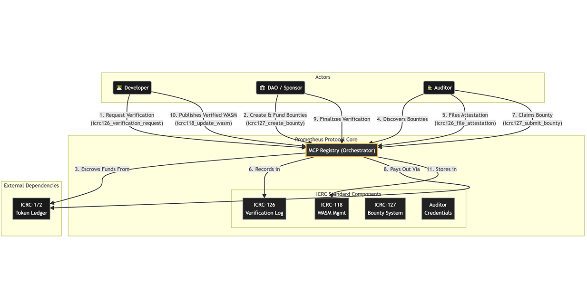
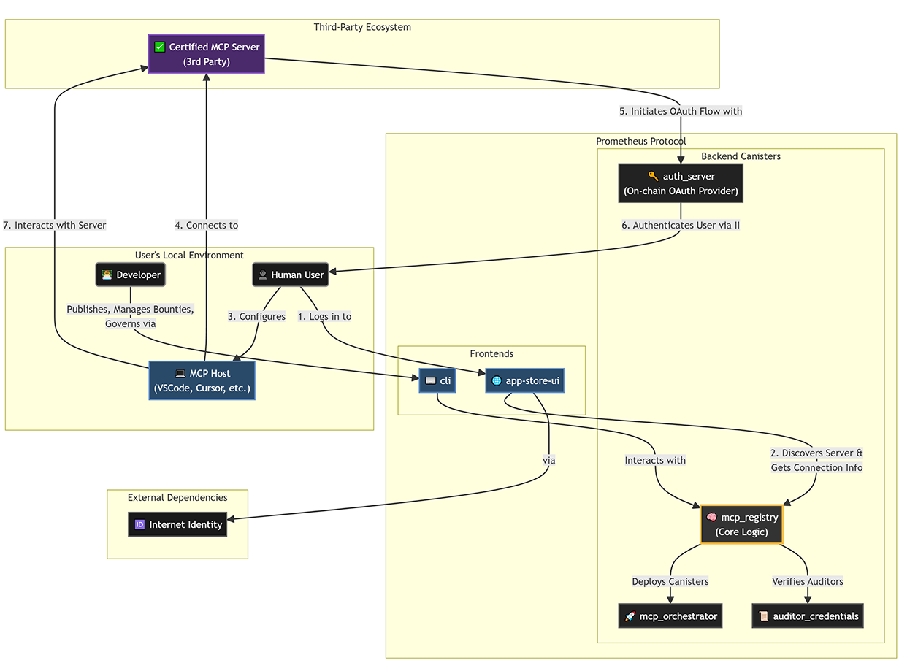

<p align="center">
  <a href="https://github.com/prometheus-protocol/prometheus-protocol">
    
  </a>
</p>

<p align="right">
  <i>If you find this project useful, please star it ✨</i>
</p>

---

<h2 align="center">Prometheus Protocol Monorepo</h2>
<p align="center">🏛️ <b>The Trust Layer for the AI Economy on the Internet Computer.</b></p>

---

<p align="center">
  <b>Please note that this project is under active development. APIs might change before version 1 is released.</b>
</p>

<p align="center"><a href="https://github.com/prometheus-protocol/prometheus-protocol/blob/main/LICENSE"></a>&nbsp;<a href="https://www.npmjs.com/package/@prometheus-protocol/cli"></a>&nbsp;<a href="https://github.com/prometheus-protocol/prometheus-protocol/actions/workflows/tests.yml"></a>&nbsp;<a href="https://discord.gg/TbqgYERjYw"></a>&nbsp;<a href="https://github.com/prometheus-protocol/prometheus-protocol"></a></p>

## Project Summary

Prometheus Protocol is the open-source trust layer for the decentralized AI economy on the Internet Computer. We provide a seamless, on-chain experience for **identity, verifiable trust, and programmable payments**—empowering users, agents, and developers to participate in an open, secure machine-to-machine economy. Our full-stack solution includes a verifiable App Store, an on-chain OAuth 2.1 identity provider, and a complete developer toolchain with a CLI and SDKs.

## Table of Contents

1.  [Problem](#problem)
2.  [Solution Overview](#solution-overview)
3.  [Hackathon Submission Highlights](#hackathon-submission-highlights)
4.  [Core Features](#core-features)
5.  [Monetization & Sustainability](#monetization--sustainability)
6.  [Technologies & ICP Features Used](#technologies--icp-features-used)
7.  [System Architecture](#system-architecture)
8.  [Demo Links & Resources](#demo-links--resources)
9.  [Project Setup](#project-setup)
10. [Testing](#testing)
11. [Deploying to ICP Mainnet](#deploying-to-icp-mainnet)
12. [Challenges & Learnings](#challenges--learnings)
13. [Roadmap & Future Work](#roadmap--future-work)
14. [Deployment Team](#deployment-team)
15. [License](#license)

---

## Problem

As autonomous AI agents proliferate, they rely on a decentralized network of specialized servers (MCPs) to perform their work. But this creates a fundamental problem: **how can an agent, or its owner, trust a third-party server?** How can we be sure it's secure, reliable, and won't manipulate data or poison AI models? This lack of a unified trust layer fragments the AI economy and hinders its growth.

---

## Solution Overview

**Prometheus Protocol** provides the solution by creating a transparent, on-chain "app store" for AI infrastructure, governed by cryptographic proofs, economic incentives, and a decentralized community.

[](https://www.youtube.com/watch?v=4YvL-2Jt0I0)

---

## Hackathon Submission Highlights

For the WCHL25 National Round, our team focused on building the complete **Trust Layer** to complement our existing economic foundation. This represents a massive leap forward, delivering a full-stack, end-to-end solution for a secure software supply chain.

**Key features built and delivered during this round include:**

- **The Verifiable App Store Backend:** A fully on-chain registry for MCP servers, architected on open ICRC standards (118, 120, 126, 127). It manages versions, cryptographic proofs, and audit attestations, all governed by a DAO.
- **The Prometheus CLI (`prom-cli`):** A purpose-built command-line interface that serves both sides of the ecosystem:
  - **For Developers:** `prom-cli submit` allows developers to publish their MCP servers and submit new versions for verification.
  - **For Auditors:** `prom-cli status` and `attest` commands enable auditors to discover open bounties, review code, and file on-chain cryptographic attestations.
- **The App Store Frontend:** A user-facing web application for the discovery and inspection of MCP servers. Users can browse the registry and dive deep into any server's on-chain **Prometheus Certificate** to see the underlying audit proofs.
- **Full Integration of ICRC Standards:** We composed five different ICRC standards into a single, cohesive system, demonstrating the power of the IC's open protocols.

---

## Core Features

|     | Feature                   | Description                                                           |
| :-: | ------------------------- | --------------------------------------------------------------------- |
| 🛡️  | Secure On-Chain OAuth 2.1 | Production-grade identity and authorization for any service.          |
| 🔎  | Verifiable App Store      | Certified discovery, audit trails, and cryptographic code provenance. |
| 💸  | ICRC-2 Allowance Payments | Direct, programmable, and low-fee token payments for M2M commerce.    |
| 🤖  | Agent-Ready APIs          | Built from the ground up for both humans and autonomous agents.       |
| 🏆  | Open-Source SDKs          | Motoko & TypeScript SDKs for rapid integration and development.       |

---

## Monetization & Sustainability

Our protocol is designed as a self-sustaining economic flywheel for the entire AI ecosystem on ICP.

1.  **Enabling Monetization (The Foundation):** Our OAuth 2.1 server provides the essential tools for any developer to monetize their AI services with on-chain micropayments.
2.  **Driving Discovery & Trust (The Marketplace):** The App Store is the public marketplace where users and agents discover these monetized servers. The Prometheus Certificate acts as a powerful signal of quality and security, reducing friction and encouraging user adoption. **Trust is the lubricant for economic activity.**
3.  **Protocol Sustainability (The DAO Treasury):** The long-term sustainability of the protocol will be managed by the Prometheus DAO. In the future, the DAO can vote to introduce a micro-fee on transactions processed by the economic layer. These funds would flow directly to the DAO treasury to fund ongoing development, security audits, and ecosystem grants, ensuring Prometheus remains a well-maintained public good.

---

## Technologies & ICP Features Used

- **Protocol:** Internet Computer Protocol (ICP), Model Context Protocol (MCP)
- **Canisters:** Motoko
- **Standards:** ICRC-1/2 (Tokens), ICRC-118 (Versioning), ICRC-120 (Orchestration), ICRC-126 (Attestation), ICRC-127 (Bounties)
- **Identity:** Internet Identity, On-Chain OAuth 2.1 with PKCE, Dynamic Client Registration
- **Advanced IC Features:** **t-ECDSA** (for JWT signing in the Auth Server), **Certified Responses** (for secure data delivery), **Timers** (for managing bounty expirations).
- **Frontend:** React, TypeScript, Vite
- **Testing:** `picjs` (powered by PocketIC), Vitest

---

## System Architecture

The protocol is a vertically integrated stack where each layer builds upon the last, ensuring a secure and seamless flow from user identity to service execution.




---

## Demo Links & Resources

- **Live App Store:** [Discover and inspect verified services](https://gyeil-qyaaa-aaaai-q32uq-cai.icp0.io/)
- **Video Pitch & Demo:** [Watch our Vision, Architecture Overview, and Code Walkthrough](https://www.youtube.com/watch?v=4YvL-2Jt0I0)
- **Design Document:** [View our UX/UI Research & Design System](design/README.md)
- **OAuth 2.1 Dashboard:** [Manage clients and grants for the payment protocol](https://bmfnl-jqaaa-aaaai-q32ha-cai.icp0.io/)

---

## Project Setup

### Requirements

- Node.js >= 18.x.x
- [DFINITY SDK (`dfx`)](https://internetcomputer.org/docs/current/developer-docs/quickstart/local-quickstart)
- [pnpm](https://pnpm.io/installation) (for monorepo management)
- [Mops](https://mops.one/) (Motoko Package Manager)

### Installation Guide

1.  **Clone the repository**
    ```bash
    git clone https://github.com/prometheus-protocol/prometheus-protocol.git
    cd prometheus-protocol
    ```
2.  **Install dependencies**
    ```bash
    pnpm install
    mops install
    ```
3.  **Start local ICP replica**
    ```bash
    dfx start --clean --background
    ```
4.  **Deploy canisters locally**
    ```bash
    dfx deploy
    ```
5.  **Run the App Store frontend**
    ```bash
    pnpm --filter @prometheus-protocol/frontend dev
    ```

---

## Testing

The project includes a comprehensive test suite to ensure reliability and correctness, hitting a key bonus criterion for the hackathon.

- **E2E & Integration Tests (`picjs`):** We use `picjs`, a powerful testing library powered by **PocketIC**, to run end-to-end tests that simulate real-world interactions between all canisters in a deterministic local environment.
  ```bash
  pnpm test:canisters
  ```
- **Unit Tests (Motoko):** Core business logic within individual canisters is verified with `mo:test`.
  ```bash
  mops test
  ```

---

## Deploying to ICP Mainnet

1.  **Log in with your mainnet identity:**
    ```bash
    dfx identity use <your-mainnet-identity>
    ```
2.  **Deploy all canisters:**
    ```bash
    dfx deploy --network=ic
    ```

**Mainnet Canister IDs:**

- **App Store UI:** `gyeil-qyaaa-aaaai-q32uq-cai`
- **MCP Registry:** `grhdx-gqaaa-aaaai-q32va-cai`
- **MCP Orchestrator:** `ez54s-uqaaa-aaaai-q32za-cai`
- **Auditor Credentials:** `eq6xo-cyaaa-aaaai-q32yq-cai`
- **OAuth Server:** `bfggx-7yaaa-aaaai-q32gq-cai`
- **OAuth Frontend:** `bmfnl-jqaaa-aaaai-q32ha-cai`
- **ICRC1 Ledger (PMP):** `dy3i7-mqaaa-aaaai-q32ja-cai`

---

## Challenges & Learnings

Building a full-stack, on-chain trust layer presented several unique challenges during the hackathon:

1.  **On-Chain OAuth 2.1 Security:** Implementing a secure OAuth server on a public blockchain required a novel approach. We leveraged mandatory PKCE, certified responses, and a unique `request_id` system to protect against code interception and malicious boundary nodes, ensuring that secret access tokens are never publicly exposed.
2.  **ICRC Standard Composability:** Integrating five different ICRC standards (1, 2, 118, 120, 126, 127) into a cohesive system was a significant architectural challenge. It required careful state management and inter-canister communication patterns to ensure data consistency and atomicity where needed.
3.  **CLI Tooling & Build Process:** Creating a professional CLI with a unified developer experience required solving complex build issues, particularly managing ESM/CJS module compatibility between our shared libraries and the final executable, which we solved using `esbuild`'s `define` and `external` features.

---

## Roadmap & Future Work

Our journey is structured in ambitious phases, building from a solid foundation towards a vibrant, trusted ecosystem.

<details>
  <summary><strong>Phase 0: The Foundation (✅ COMPLETE)</strong></summary>
  <p><strong>Goal:</strong> Forge the complete, end-to-end stack for secure identity and payments.</p>
  <ul>
    <li><strong>[x] The Core Auth Server:</strong> Implemented the core OAuth 2.1 flows, JWT signing, and modern security standards.</li>
    <li><strong>[x] The Developer SDKs:</strong> Released <code>motoko-mcp-sdk</code> and <code>@prometheus-protocol/typescript-sdk</code> for building and integrating monetizable services.</li>
    <li><strong>[x] The Proof of Concept:</strong> Deployed live demos showcasing the full identity and payment stack.</li>
  </ul>
</details>

<details>
  <summary><strong>Phase 1: The Trust Layer (⏳ NEARING COMPLETION)</strong></summary>
  <p><strong>Goal:</strong> Build the premier, high-trust software supply chain for provably safe services, establishing the gold standard for reliability in the agent economy.</p>
  <ul>
    <li><strong>[x] The On-Chain Supply Chain Hub:</strong> Deployed the <code>mcp_registry</code> (ICRC-118/126/127) and <code>mcp_orchestrator</code> (ICRC-120).</li>
    <li><strong>[x] The Developer & Auditor Tooling:</strong> Developed and shipped the complete <code>@prometheus-protocol/cli</code>.</li>
    <li><strong>[x] The App Store Frontend:</strong> Deployed a user-friendly web interface for discovering services and viewing their on-chain certification status.</li>
    <li><strong>[x] The Governance & Audit Workflow:</strong> Implemented the full on-chain workflow for Developers, Auditors, and the DAO.</li>
    <li><strong>[ ] DAO Formation & Onboarding:</strong> Formally constitute the governing DAO and onboard the initial set of trusted auditors.</li>
    <li><strong>[ ] Security Hardening:</strong> Submit the entire canister suite for a professional, third-party security audit.</li>
  </ul>
</details>

<details>
  <summary><strong>Phase 2: Ecosystem Growth (🚀 UP NEXT)</strong></summary>
  <p><strong>Goal:</strong> With a unified platform for trust, identity, and payments, the focus shifts to scaling the ecosystem through strategic onboarding and partnerships.</p>
  <ul>
    <li><strong>[ ] Onboard the First Wave of Production Services:</strong> Actively recruit and support high-value developers to publish their services on the platform.</li>
    <li><strong>[ ] Drive Client-Side Integration:</strong> Partner with developers of AI agents and MCP clients to integrate the registry as a primary, high-trust service source.</li>
    <li><strong>[ ] Accelerate Community Adoption:</strong> Launch community initiatives such as hackathons, developer grants, and comprehensive tutorials.</li>
  </ul>
</details>

<details>
  <summary><strong>Phase 3: The Autonomous Economy</strong></summary>
  <p><strong>Goal:</strong> Evolve from a platform managed by the founding team into a self-sustaining, community-governed economic protocol.</p>
  <ul>
    <li><strong>[ ] Full Decentralization & Curation:</strong> Transition full control of the Registry Hub and its policies to the DAO, cementing its status as a decentralized public utility.</li>
    <li><strong>[ ] Advanced Economic Primitives:</strong> Enable security bonds and atomic, on-chain revenue sharing for services.</li>
  </ul>
</details>

---

## Community & Contribution

Prometheus is a fully open-source project, and we welcome contributions of all kinds.

- ⭐ **Star the repo:** The easiest way to show your support!
- 💬 **Join the conversation:** [Join our Discord server](https://discord.gg/TbqgYERjYw) to chat with the team and community.
- 🐞 **Report bugs:** Find a bug? Open an issue in the [Issues tab](https://github.com/prometheus-protocol/prometheus-protocol/issues).
- 💡 **Suggest features:** Have an idea? Start a discussion in the [Discussions tab](https://github.com/prometheus-protocol/prometheus-protocol/discussions).
- ✍️ **Contribute code:** Check out our [Contribution Guidelines](CONTRIBUTING.md) to get started.

---

## Deployment Team

- **Roblynn** — Project Manager
- **Jesse** — Lead Developer
- **Hannah** — UX/UI Designer

---

## License

This project is licensed under the **MIT License**. See the [LICENSE](LICENSE) file for details.
