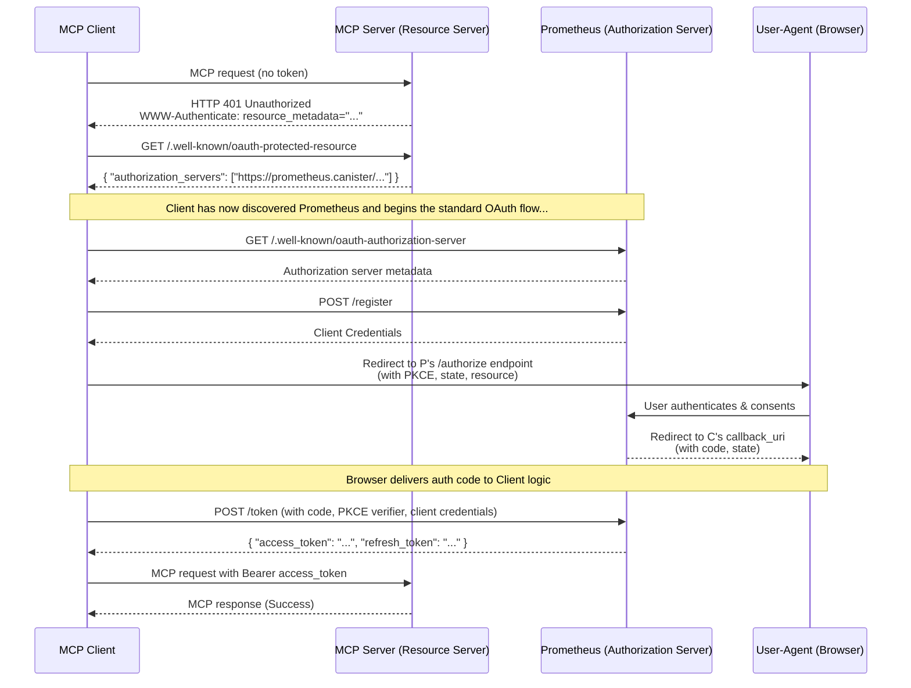

# Prometheus Protocol - Auth Canister


## Overview

Prometheus Protocol is a full-featured, on-chain **OAuth 2.1 provider** built for the Internet Computer. It provides a robust, general-purpose solution for any application requiring standards-based authentication and authorization.

While designed for broad use, it is also a fully compliant **Authorization Server** for the **Model Context Protocol (MCP)** ecosystem. This dual focus ensures that Prometheus is both a flexible tool for the wider IC community and a hardened, specification-compliant engine for enterprise-grade protocols.

It enables developers to secure applications using the industry-standard **Authorization Code Flow with PKCE**.

It supports flexible, **multi-token payment authorization**, allowing resource servers to define which ICRC-2 tokens they accept for payment-gated scopes.

## Live Ecosystem & Demos

Prometheus is live on ICP mainnet. You can interact with the protocol and see it in action through these resources:

- **[Prometheus Protocol Dashboard](https://bmfnl-jqaaa-aaaai-q32ha-cai.icp0.io/):** Manage your client applications, grants, and allowances.
- **[PMP Token Faucet](https://remote-mcp-servers.com/servers/e4dc7647-14d3-43da-8513-3087e013cd3b):** A live MCP server that provides free PMP test tokens to help you get started with development.
- **[Sentiment Analysis Demo](https://remote-mcp-servers.com/servers/491314bc-27b3-4070-b2c2-39ad971c36c4):** A simple, monetized AI tool built with our TypeScript SDK that demonstrates the end-to-end payment flow.

## Features & Compliance

Prometheus Protocol implements the latest security best practices from the IETF and the specific requirements of the MCP specification.

- ✓ **OAuth 2.1 Core:** Implements the modern, secure baseline for OAuth, including mandatory PKCE (`RFC 7636`) and the Authorization Code Flow (`RFC 6749`).
- ✓ **Refresh Token Rotation:** Enhances security by issuing a new, single-use refresh token each time one is used, mitigating the risk of token theft.
- ✓ **Dynamic Client Registration (DCR):** A public `/register` endpoint (`RFC 7591`) allows applications to register programmatically without manual intervention.
- ✓ **Resource Indicators:** Supports token audience binding via the `resource` parameter (`RFC 8707`), ensuring tokens are used only at their intended destination.
- ✓ **ICRC-2 Payment Authorization:** Enables resource servers to specify a list of accepted ICRC-2 compliant tokens for payment-gated scopes (e.g., `prometheus:charge`).
- ✓ **Server Metadata:** Provides `/.well-known/oauth-authorization-server` (`RFC 8414`) and `/.well-known/jwks.json` endpoints for automated client configuration and key discovery.
- ✓ **MCP Authorization Spec Compliant:** Fully adheres to the requirements for an Authorization Server within the MCP ecosystem (rev. 2025-06-18).

## Architecture

The protocol is designed to be a foundational piece of infrastructure for the Internet Computer, enabling secure interactions between users, client applications, and protected resource servers.

### Architectural Diagram


### Key Components

- **Client Application (e.g., an MCP Client, a React SPA):** The user-facing application that initiates the login flow.
- **Prometheus Protocol (This Project):** The central Authorization Server that handles user authentication, consent, and the issuance of secure tokens.
- **Resource Server (e.g., an MCP Server, a protected backend API):** The service that requires authorization and validates the tokens issued by Prometheus before granting access to its resources.

  It also defines the list of accepted ICRC-2 payment tokens for any payment-gated scopes it offers.

<details>
  <summary><strong>Understanding the MCP Discovery Flow</strong></summary>



</details>

## On-Chain Security Model

Building a secure OAuth 2.1 provider on a public blockchain like the Internet Computer requires a specific design that leverages the platform's unique features while mitigating its inherent transparency. The Prometheus Protocol is built on a "trustless" model, meaning you do not need to trust the boundary nodes delivering the data; security is enforced by cryptography at the protocol level.

Here are the core security principles and assumptions of this implementation:

### 1. Protection of Secrets during Token Exchange

The most critical part of the OAuth flow is the `/token` endpoint, where a short-lived `authorization_code` is exchanged for a long-lived `access_token`.

- **State Change is Required:** To prevent replay attacks, the canister **must** change its state to invalidate the `authorization_code` after a single use. On the IC, any state-changing call must be an **`update` call**.

- **Asynchronous Handling for HTTP Clients:** For standard HTTP clients (like `curl` or a Node.js backend) that are not using an IC-specific identity, these `update` calls are handled asynchronously. The canister's response, containing the secret `access_token`, **is temporarily written to the IC's state tree** so the client can poll for it using a `request_id`.

- **Security of the On-Chain Response:** This process is secure due to two fundamental IC features:
  1.  **Secret Path via `request_id`:** The response is not stored in a public, enumerable location. It is stored at a path derived from a secret `request_id`. This ID is a hash of the request's content, which includes secrets known only to the client (the `authorization_code`, `PKCE verifier`, and a random `nonce`). An attacker cannot predict this ID and therefore cannot find the token in the state tree.
  2.  **Certified Responses & Secure Transport:** The boundary node that retrieves this result for the client receives it along with a **Certificate** signed by the IC. This certificate cryptographically proves the response is authentic and untampered. The boundary node then delivers this certified response to the client over a standard, secure HTTPS (TLS) connection. This ensures that even a malicious boundary node cannot forge a fake token response, and a network attacker cannot eavesdrop on the final delivery.

### 2. Unauthenticated Calls and the `request_id`

For clients that do not have an IC identity (e.g., a standard web app), `update` calls are handled asynchronously. The client first receives a `request_id` and then polls for the result.

- **The `request_id` is Unpredictable:** The `request_id` is a 32-byte SHA-256 hash derived from the content of the original request, which includes multiple secrets known only to the client (the `authorization_code`, the `PKCE verifier`, and a random `nonce`). An attacker cannot predict or calculate this ID.
- **The Result Path is Secret:** The access token is stored temporarily in the canister's state tree at a path derived from this secret `request_id` (e.g., `/request_status/<request_id>/reply`).
- **Access is Restricted by the IC Protocol:** The Internet Computer's protocol itself enforces that only the principal that made the original request is allowed to poll for its status.

This means that while the token temporarily exists in the public state tree, its location is protected by an unguessable secret path, making it impossible for an attacker to find and steal it.

### 3. PKCE as a Hard Requirement

Prometheus enforces **Proof Key for Code Exchange (PKCE)** on all authorization code grants, as mandated by OAuth 2.1. This is the primary defense against authorization code interception attacks. Even if an attacker steals a `code` from a redirect URL, it is useless without the corresponding secret `code_verifier`, which never leaves the legitimate client.

## Getting Started (Local Development)

This guide walks through running the full end-to-end flow locally, simulating the roles of both a Client and a Resource Server.

### Prerequisites

- [DFINITY Canister SDK (dfx)](https://internetcomputer.org/docs/current/developer-docs/setup/install/)
- [Node.js](https://nodejs.org/) & [npm](https://nodejs.org/)
- [Mops](https://mops.one/) (Motoko Package Manager)
- [jq](https://stedolan.github.io/jq/) (Command-line JSON processor)

### 1. Clone & Install

```bash
git clone <your-repo-url>
cd <your-repo-directory>
npm install
mops install
```

### 2. Deploy Local Environment

This command starts a local replica and deploys the Prometheus canisters and mock ICRC-2 ledgers (e.g., PMP and ckUSDC).

```bash
dfx start --clean --background
dfx deploy
```

## Running the Full Test Flow

This sequence validates the entire process from the perspective of a developer building a client application.

### Phase 0: Register a Resource Server (Environment Setup)

Before a client can request tokens, a resource server must exist. This script registers a mock resource server configured to accept payments in multiple ICRC-2 tokens, setting up the multi-token test environment.

```bash
# This script registers a resource server that accepts PMP and ckUSDC
./scripts/register_resource_server.sh
```

### Phase 1: Register Your Client

Your application first needs to register itself with Prometheus to get credentials.

```bash
# This script calls the /register endpoint and saves credentials to .env.prom
./scripts/register_client.sh
```

### Phase 2: Initiate User Authorization

Next, your application directs the user to Prometheus to log in and grant consent.

1.  **Generate the Authorize URL:** This script creates a secure PKCE challenge and constructs the full authorization URL, including the mandatory `state` and `resource` parameters.

    ```bash
    # This generates the URL and saves the PKCE verifier to .env.prom
    node ./scripts/generate-auth-url.js
    ```

2.  **Authorize in Browser:**
    - Copy the full `/authorize` URL printed by the script.
    - Paste it into your browser and complete the Internet Identity login.
    - If the `prometheus:charge` scope was requested, you will be prompted to **select a payment token** (e.g., PMP or ckUSDC) and set an allowance before reaching the consent screen.
    - You will be redirected to `https://jwt.io` (our example `redirect_uri`).
    - **Copy the `code` value from the resulting URL.**

### Phase 3: Exchange the Code for Tokens

Your application's backend now exchanges the single-use code for an access token and a refresh token.

1.  **Load Credentials:** Make sure your shell has the `client_id` and `PKCE_VERIFIER` loaded.

    ```bash
    source .env.prom
    ```

2.  **Get Tokens:** Run the `get_token.sh` script, passing the code you copied.
    ```bash
    ./scripts/get_token.sh <THE_CODE_YOU_COPIED>
    ```
    The command will return a JSON object containing your `access_token` and `refresh_token`.

### Phase 4: Use the Refresh Token

When the access token expires, your application can use the refresh token to get a new one without requiring the user to log in again.

1.  **Refresh Tokens:** Run the `refresh_token.sh` script, passing the `refresh_token` from the previous step.
    ```bash
    # Make sure to use the actual refresh_token value
    ./scripts/refresh_token.sh <THE_REFRESH_TOKEN>
    ```
    This will return a **new** `access_token` and a **new** `refresh_token`.

### Phase 5: Verify the JWT

A Resource Server would perform this step to validate the token it receives.

1.  **Go to [jwt.io](https://jwt.io)** and paste the `access_token` into the "Encoded" box.
2.  **Get the Public Key:** Run the following command to fetch the server's public key set.
    ```bash
    curl http://$(dfx canister id oauth_backend).localhost:4943/.well-known/jwks.json | jq
    ```
3.  **Verify Signature:**
    - Copy the key object from the `keys` array in the terminal output.
    - On jwt.io, paste it into the "Public Key" box.
    - **Crucially, change the "Public Key Format" dropdown from `PEM` to `JWK`.**
    - The signature should now be verified.


## Running Tests

The project includes a comprehensive test suite using Vitest for E2E tests and `mo:test` for unit tests.

```bash
# Run all unit and integration tests
mops test

# Run all end-to-end tests
npm run test
```

## License

This project is licensed under the MIT License.
