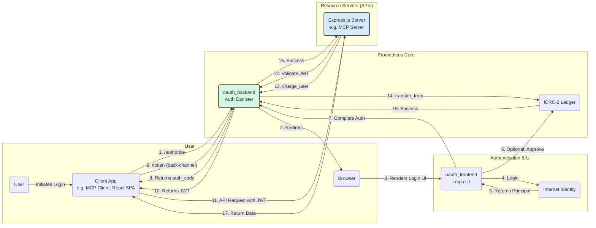

# Prometheus Protocol - Auth Canister


## Overview

Prometheus Protocol is a full-featured, on-chain OAuth2 provider built for the Internet Computer. It enables developers to secure their applications using the industry-standard **Authorization Code Flow with PKCE**, allowing users to log in with their Internet Identity and grant specific permissions to third-party applications.

The system is designed for modern, self-service developer workflows, featuring **Dynamic Client Registration** and a simple, fee-based activation model. It issues standards-compliant JSON Web Tokens (JWTs) that can be verified by any resource server in the ecosystem, providing a decentralized and robust foundation for authentication and authorization.

## Current Status: Phase 0 Complete

[**Phase 0: Project Chimera**](https://github.com/prometheus-protocol) is complete. The core authentication engine is online, feature-complete, and compliant with modern security standards.

**Key Features Implemented:**

- **OAuth2 Authorization Code + PKCE:** Implements the full flow as per [RFC 6749](https://tools.ietf.org/html/rfc6749) and the secure Proof Key for Code Exchange enhancement as per [RFC 7636](https://tools.ietf.org/html/rfc7636).
- **Dynamic Client Registration (DCR):** A public `/register` endpoint allows any client to programmatically register itself without manual setup, as per [RFC 7591](https://tools.ietf.org/html/rfc7591).
- **Fee-Based Client Activation:** A unique on-chain model prevents spam by requiring a one-time fee to activate a dynamically registered client, making it useful.
- **Standards-Compliant JWTs:** Generates `ES256` signed JWTs using the web-standard `P-256` curve for maximum interoperability.
- **Public Key Discovery (JWKS):** Exposes the public signing key via a standard `/.well-known/jwks.json` endpoint.
- **Server Metadata:** Provides a `/.well-known/oauth-authorization-server` discovery document for automated client configuration, as per [RFC 8414](https://tools.ietf.org/html/rfc8414).
- **Resource Indicators:** Supports the specification of resource indicators during authorization to indicate the target resource server for the token as defined in [RFC 8707](https://tools.ietf.org/html/rfc8707)


## Architecture

The Prometheus Protocol is designed to bridge the Web2 and Web3 economies by enabling traditional, off-chain services to accept on-chain micropayments in a secure and decentralized manner. The architecture is built around a set of core canisters on the Internet Computer and a client-side SDK that simplifies integration for service providers.

### Architectural Diagram

This diagram illustrates the complete flow, from a user initiating a login in a client application to the final, successful micropayment on the resource server.



### Key Components

The protocol is composed of several key components that work in concert:

*   **`oauth_backend` (The Core Engine):** This is the main canister and the heart of the protocol. It is a stateful canister responsible for:
    *   Registering and managing Client Applications and Resource Servers.
    *   Handling the OAuth2 `/authorize` and `/token` endpoints.
    *   Issuing, signing, and managing JWTs (JSON Web Tokens).
    *   Serving public keys via the `/.well-known/jwks.json` endpoint for JWT validation.
    *   Processing payments by calling the ICRC-2 Ledger canister.

*   **`oauth_frontend` (The Login UI):** A dedicated UI canister that provides a user-friendly interface for the authentication process. Its primary roles are:
    *   Integrating with `@dfinity/auth-client` to handle the login flow with Internet Identity.
    *   Providing a UI for the user to grant a spending allowance (`icrc2_approve`) to the `oauth_backend` canister.
    *   Finalizing the authorization flow by calling back to the `oauth_backend`.

*   **Resource Server (The Service Provider):** This is the Web2 service that wants to charge for its API. For example, an **MCP Server**. It is responsible for:
    *   Protecting specific API endpoints.
    *   Using standard middleware (e.g., `express-jwt`) to validate incoming JWTs.
    *   Using the Prometheus JS SDK to trigger the micropayment.

*   **Client Application (The Initiator):** This is the application the user interacts with, such as an **MCP Client** or a React Single-Page App. It is responsible for:
    *   Initiating the OAuth2 flow by redirecting the user to the `oauth_backend`.
    *   Receiving the `authorization_code` after a successful login.
    *   Securely exchanging the code for a JWT.
    *   Storing the JWT and including it in subsequent requests to the Resource Server.

*   **Prometheus JS SDK (`@prometheus-protocol/typescript-sdk`):** A client library for Node.js that dramatically simplifies integration for Resource Server developers. It abstracts away the complexity of:
    *   Creating an authenticated agent using a server's private key (`.pem` file).
    *   Making a secure, authenticated inter-canister call to the `charge_user` method on the `oauth_backend`.

*   **ICRC-2 Ledger Canister (The Bank):** A standard token canister that holds user funds. Its role is strictly financial:
    *   To hold token balances for users.
    *   To manage spending allowances granted via `icrc2_approve`.
    *   To execute payments via `icrc2_transfer_from` when called by the `oauth_backend`.

*   **Internet Identity (The Authenticator):** The decentralized authentication service on the Internet Computer. It is used to securely verify the user's identity and provide a stable `Principal` to the protocol.

## Getting Started

Follow these steps to set up and run the project locally.

### Prerequisites

- [DFINITY Canister SDK (dfx)](https://internetcomputer.org/docs/current/developer-docs/setup/install/)
- [Node.js](https://nodejs.org/) (for frontend dependencies)
- [Mops](https://mops.one/) (for Motoko package management)
- [jq](https://stedolan.github.io/jq/) (for processing JSON in helper scripts)

### 1. Clone & Install Dependencies

Clone the repository and install all necessary packages.

```bash
git clone <your-repo-url>
cd <your-repo-directory>
npm install
mops install
```

### 2. Start the Local Replica & Deploy

Start a clean local replica instance and deploy the canisters. The `dfx.json` is pre-configured to deploy a local ICRC-2 ledger and our canisters.

```bash
dfx start --clean --background
dfx deploy
```

## Running the End-to-End Flow

This sequence validates the entire process, from registering a new app to getting a valid token.

### Phase 1: Register & Activate Your Client

First, we'll register a new client application and pay the one-time fee to activate it.

1.  **Register the Client:**
    Run the `register_client.sh` script. This will call the `/register` endpoint and save your new `client_id` and `client_secret` to a file named `.env.prom`.

    ```bash
    ./scripts/register_client.sh
    ```

2.  **Load Credentials:**
    Load the new credentials into your current shell session by "sourcing" the environment file.

    ```bash
    source .env.prom
    ```

3.  **Activate the Client:**
    Activation requires a one-time fee. First, approve the fee from your principal, then call the `activate_client` function.

    ```bash
    # A. Approve the fee (50 PMP tokens)
    dfx canister call icrc1_ledger icrc2_approve '(record { spender = record { owner = principal "'$(dfx canister id oauth_backend)'" }; amount = 50_00000000 })'

    # B. Call the activate function with your new credentials
    dfx canister call oauth_backend activate_client "(\"$NEW_CLIENT_ID\", \"$NEW_CLIENT_SECRET\")"
    ```

    You should see `(ok = "Client successfully activated.")`. Your client is now ready to use.

### Phase 2: Get an Authorization Code

Now, we'll initiate the login flow for a user.

1.  **Generate the Authorize URL:**
    Run the `generate-auth-url.js` script. This creates a secure PKCE challenge and saves the necessary `code_verifier` to your `.env.prom` file.

    ```bash
    node ./scripts/generate-auth-url.js
    ```

2.  **Load the Verifier:**
    Source the environment file again to load the new `PKCE_VERIFIER` variable.

    ```bash
    source .env.prom
    ```

3.  **Authorize in Browser:**
    - Copy the full `/authorize` URL printed by the script.
    - Paste it into your browser.
    - You will be redirected to the login page. Complete the Internet Identity login and the subscription flow if necessary.
    - You will be redirected to `https://jwt.io`. The URL will contain the authorization code: `https://jwt.io/?code=<A_LONG_HEX_STRING>&...`
    - **Copy the `code` value.**

### Phase 3: Exchange Code for Token

1.  **Get the Token:**
    Run the `get_token.sh` script, passing the code you just copied as an argument.

    ```bash
    ./scripts/get_token.sh <THE_CODE_YOU_COPIED>
    ```

2.  **Capture the Token:**
    The command will return a JSON object containing your `access_token`. Copy it.

### Phase 4: Verify the Token

Finally, verify the token's signature against the canister's public key.

1.  **Verify on jwt.io:**
    - Go to [https://jwt.io](https://jwt.io).
    - Paste the `access_token` into the "Encoded" box.

2.  **Get the Public Key:**
    - Run `curl http://$(dfx canister id oauth_backend).localhost:4943/.well-known/jwks.json | jq .`
    - Copy the first key object from the `keys` array.

3.  **Verify Signature:**
    - On jwt.io, paste the key object into the "Public Key" box.
    - **Crucially, change the "Public Key Format" dropdown from `PEM` to `JWK`.**

    You should see the green **"Signature Verified"** message.


## Running Tests

The project includes a comprehensive test suite using the `mo:test` library. To run all unit and replica tests, use Mops:

```bash
mops test
```

## License

This project is licensed under the MIT License.
