Our mission is to enable a new generation of decentralized applications by providing the open-source, on-chain foundation for verifiable trust, secure identity, and near-zero fee payments.

## How Might We (HMW)

How might we empower developers, users, and organizations to confidently build, discover, and transact with decentralized applications—by providing a seamless, transparent, and secure on-chain experience that sets a new standard for trust, identity, and payments?

## The Issue

As autonomous AI agents become more powerful and influential, the infrastructure they depend on grows critically important. These agents—whether serving users, organizations, or other systems—must connect to specialized servers to access resources, data, and computational power.

But this new landscape raises urgent questions:

- How can an agent, or its owner, trust that a third-party server is secure, reliable, and won’t manipulate data or poison its model?
- How can developers of these servers prove to their users that they are trustworthy, compliant, and operating with integrity?

This is the core challenge at the frontier of decentralized AI:Building a foundation of verifiable trust, security, and transparency for every connection, transaction, and interaction.

## The Solution

Prometheus Protocol is a fully transparent, trustless “app store” for AI infrastructure—purpose-built to solve the modern challenges of decentralized trust.
Unlike traditional systems that rely on a central authority for approval and oversight, Prometheus leverages a transparent, on-chain process governed by cryptographic proofs and open economic incentives. Every step, from server registration to audit and endorsement, is publicly verifiable and tamper-proof.

Before any new version of an MCP server can be published, it must pass a series of community-driven audits. This ensures that only secure, reliable, and transparent infrastructure is available in the ecosystem—giving both agents and their owners true peace of mind, and providing server developers with a clear, objective path to earning user trust.

Prometheus Protocol sets a new standard for trust, accountability, and transparency in the emerging AI agent economy.

## The Three Pillars of Trustworthy Digital Economy

To build a foundation of lasting trust in decentralized applications, security and transparency must be engineered at every layer. Prometheus Protocol is designed around three core pillars—Secure Identity & Authorization, Verifiable Trust & Discovery, and Direct & Efficient Payments—each solving a fundamental challenge for the next generation of users, developers, and organizations.

Together, these pillars form an integrated solution for secure access, reliable app discovery, and seamless, user-controlled payments—enabling a digital economy where trust is verifiable, not just promised.

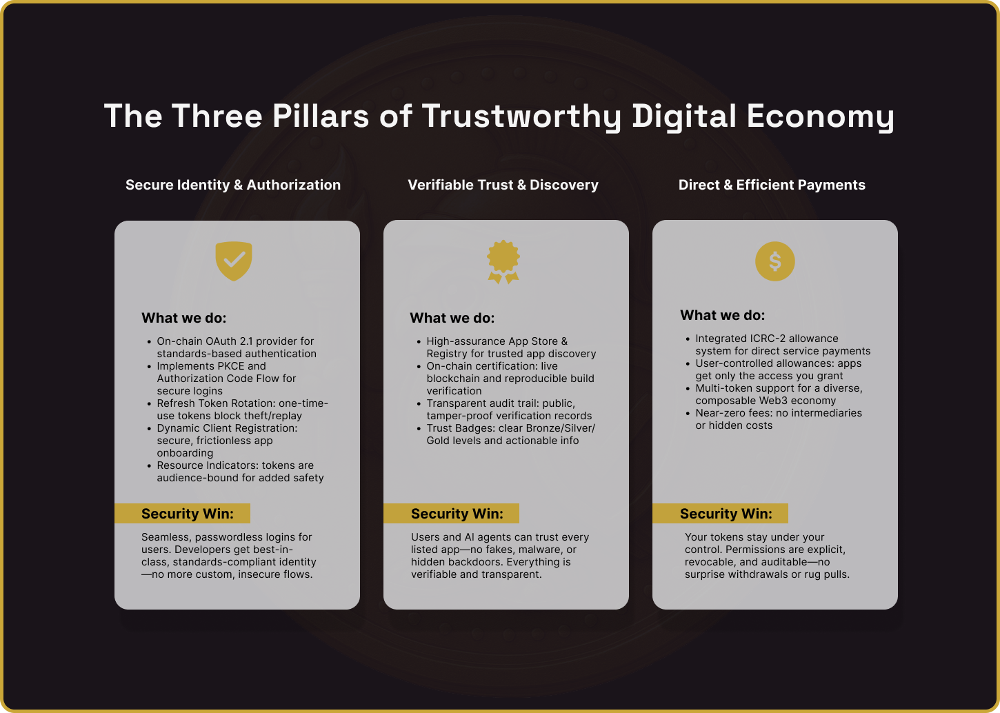

## SWOT Analysis

To ensure Prometheus Protocol delivers on its mission of enabling trustworthy, decentralized digital infrastructure, we conducted a comprehensive SWOT analysis. This process helped our team identify the project’s core strengths, anticipate potential challenges, and uncover key opportunities and threats within the evolving landscape of decentralized AI and Web3 applications. The following insights have directly shaped both our UX approach and overall product strategy.

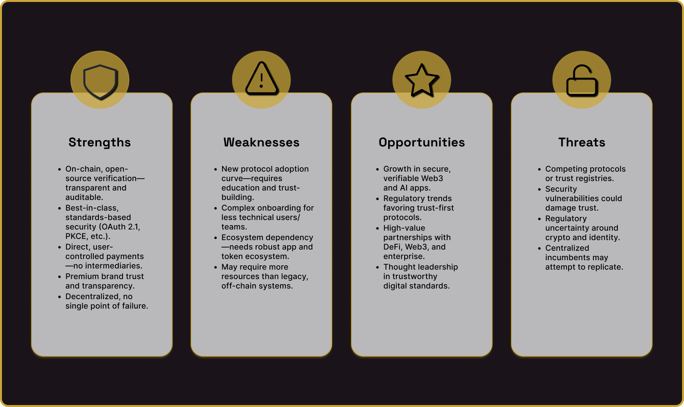

### Strengths

- On-chain, open-source verification—transparent and auditable.
- Best-in-class, standards-based security (OAuth 2.1, PKCE, etc.).
- Direct, user-controlled payments—no intermediaries.
- Premium brand trust and transparency.
- Decentralized, no single point of failure.

### Weaknesses

- New protocol adoption curve—requires education and trust-building.
- Complex onboarding for less technical users/teams.
- Ecosystem dependency—needs robust app and token ecosystem.
- May require more resources than legacy, off-chain systems.

### Opportunities

- Growth in secure, verifiable Web3 and AI apps.
- Regulatory trends favoring trust-first protocols.
- High-value partnerships with DeFi, Web3, and enterprise.
- Thought leadership in trustworthy digital standards.

### Threats

- Competing protocols or trust registries.
- Security vulnerabilities could damage trust.
- Regulatory uncertainty around crypto and identity.
- Centralized incumbents may attempt to replicate.

## User Personas

To ensure Prometheus Protocol addresses the real needs of its diverse community, we developed detailed user personas based on interviews, industry research, and stakeholder feedback. These personas capture the motivations, goals, pain points, and skills of our core user groups—shaping every aspect of our UX strategy and product decisions.

By understanding who we’re designing for, we can create experiences that are not only secure and trustworthy, but also intuitive and empowering for everyone in the decentralized ecosystem.

## User Flows

With a deep understanding of our core users, we mapped out key user flows to ensure that every critical interaction with Prometheus Protocol is seamless, secure, and transparent. These flows illustrate how each persona accomplishes their goals—whether registering a new app, verifying trust signals, or managing permissions—while highlighting decision points, potential friction, and opportunities for delight.

By documenting and refining these user journeys, we’ve created a foundation for intuitive design, smooth onboarding, and a trustworthy experience at every step.

### The Developer Flow: Publishing Your Application

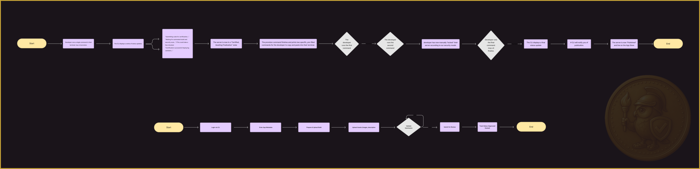

### The User Flow: Discovering and Trusting Applications

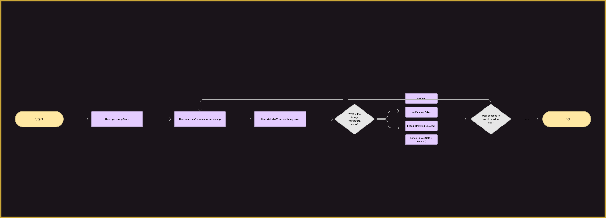

## System Architecture & Core Flows

To provide a complete picture of how Prometheus Protocol operates, we’ve mapped out the core system architecture and primary interaction flows. These diagrams illustrate how key actors—including users, developers, auditors, and third-party services—interact with the protocol’s on-chain components, registries, and external dependencies.

By visualizing these flows, we clarify how security, transparency, and trust are engineered into every stage of the platform—from identity verification and server registration to audit trails and decentralized payments. This holistic view ensures that both technical and non-technical stakeholders can understand the relationships, responsibilities, and data flows that underpin Prometheus Protocol.

### Canister Architecture

### Protocol Architecture

## Developer Experience: CLI Registration Flow (Prompts & Errors)

To support a seamless developer journey, we meticulously designed the command-line interface (CLI) for registering and verifying MCP servers. Clear, actionable prompts and error messages are essential for reducing friction, minimizing onboarding time, and ensuring that users always know what to do next.

The following table documents each step of the CLI registration and verification process, including the messages developers receive and the specific errors they might encounter. This level of transparency and guidance is a cornerstone of the Prometheus Protocol user experience—empowering developers to integrate quickly, resolve issues efficiently, and maintain confidence throughout the process.

## Design Approach

Our design process began with a series of low-fidelity wireframe sketches to explore layout concepts, user journeys, and content hierarchy. These early sketches allowed us to rapidly iterate, validate ideas, and ensure that core user needs were addressed before refining the visual language.

With the structure established, we made intentional choices around typography and color to reinforce Prometheus Protocol’s core values of trust, security, and modernity. Each element—from font selection to the color palette—was chosen to create a premium, intuitive, and accessible user experience.

### Style Tile

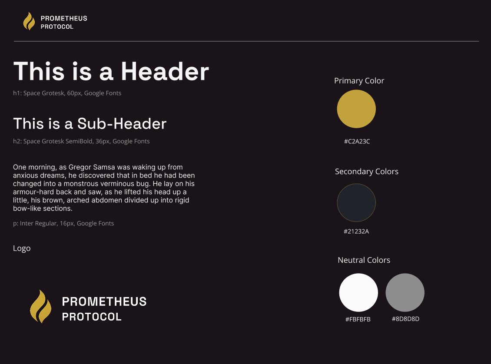

### Typography

- Headers – Space Grotesk (Bold/SemiBold):Space Grotesk was selected for its geometric, modern sans-serif style that balances trustworthiness with energy and innovation. Its strong presence at large sizes helps anchor key sections and branding, setting Prometheus Protocol apart from more conventional solutions.
- Body Text – Inter (Regular):Inter provides exceptional legibility and clarity, especially for technical content and instructions. Its clean, neutral character supports accessibility and ensures focus remains on the information, not the interface.

### Color Palette

- Primary Color – Gold (#C2A23C):Gold was chosen for its strong association with premium quality, reliability, and excellence. This color signals trust and value, echoing Prometheus Protocol’s commitment to setting a new standard for secure digital infrastructure.
- Secondary Color – Deep Charcoal (#21232A):Deep charcoal creates a sophisticated, tech-forward foundation. It enhances the impact of gold and white accents, and is a staple in modern fintech and security design for its stability and seriousness.
- Neutral Colors – White (#FBFBFB), Gray (#8D8D8D):These neutrals ensure clarity and readability while letting the primary and secondary colors stand out. They communicate transparency and professionalism—key to user trust.

### Logo, Mascot, and Token Design

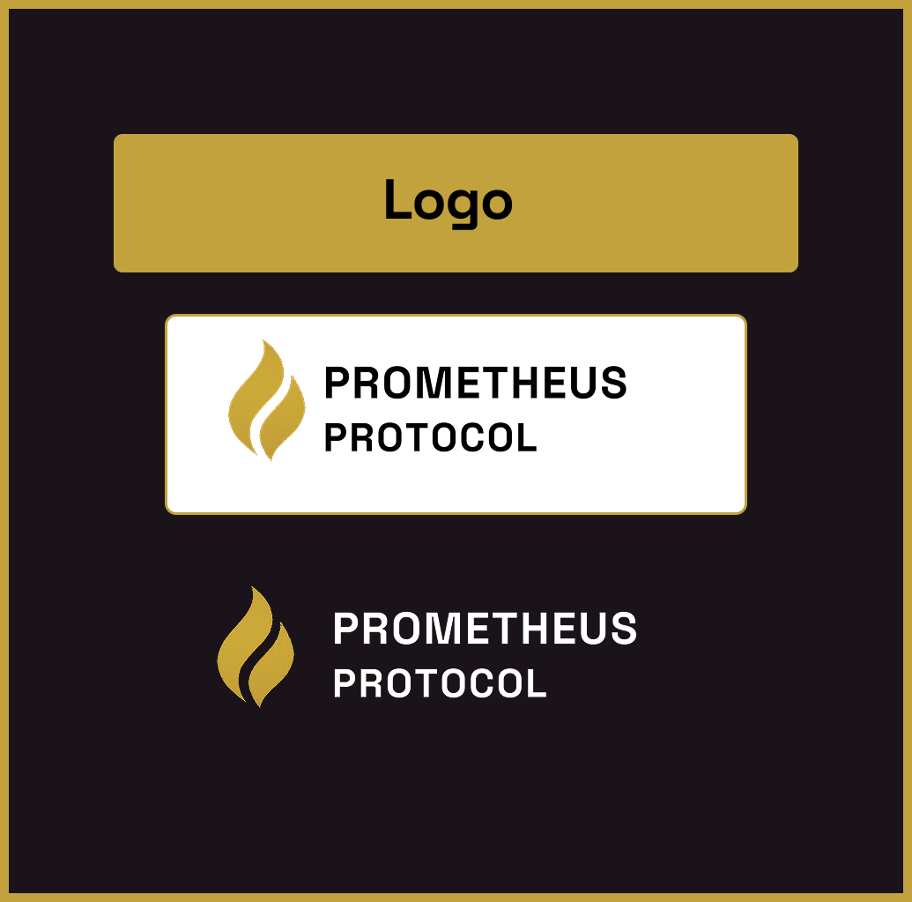

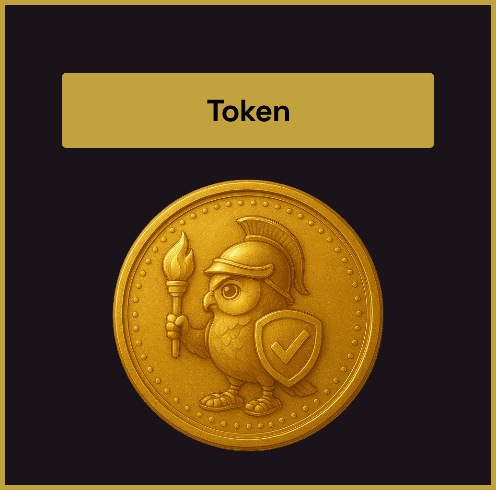

### Logo

The Prometheus Protocol logo features a stylized gold flame paired with bold, geometric typography. The flame symbolizes enlightenment, security, and technological innovation—echoing the myth of Prometheus as a bringer of knowledge and progress. The gold color ties into our premium brand palette, reinforcing trust, value, and excellence.

### Mascot: The Sentinel Owl

We chose an owl as the project mascot for its deep symbolic connections to wisdom, vigilance, and protection. Historically, owls are guardians of knowledge and trusted guides in darkness—perfect parallels for a protocol designed to help users navigate complex, risky digital landscapes with confidence.

- Protection: The shield and checkmark reinforce security, trust, and assurance.
- Guidance: The torch evokes Prometheus’ gift of fire—here, it represents clarity and innovation.
- Wisdom: Owls are universally recognized symbols of insight and judgement, helping users feel safe and informed.
- Tone: The illustration style is friendly and approachable, yet mature and non-childish—balancing accessibility with credibility for a security-focused product.

### Token Design

The token features the armored owl holding a torch and shield, rendered in a premium gold finish. This design ties together all brand elements: wisdom (owl), security (shield), trust (checkmark), and innovation (torch). The gold coin look signals value and legitimacy, while the character details reinforce the protocol’s focus on transparency, protection, and user empowerment.

Together, the logo, mascot, and token create a cohesive visual identity that is instantly recognizable, emotionally engaging, and perfectly aligned with Prometheus Protocol’s mission: enabling trustworthy, transparent, and secure digital economies.

## High-Fidelity Mockups

After validating our design direction with low-fidelity sketches and iterating on core flows, we developed a suite of high-fidelity mockups to bring the Prometheus Protocol experience to life. These detailed visual designs showcase our final choices for layout, color, typography, iconography, and micro-interactions—ensuring every pixel reinforces our commitment to trust, clarity, and premium quality.

The hi-fi mockups serve as both a blueprint for development and a communication tool for stakeholders, illustrating exactly how users will interact with key features across web, CLI, and mobile interfaces. They also provide a tangible reference for maintaining a consistent, polished brand experience as the product evolves.

### Home Page

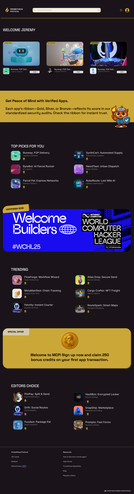

### Product Details Page

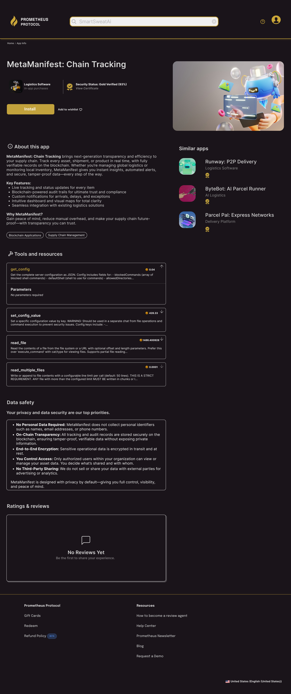

### Install Dialog

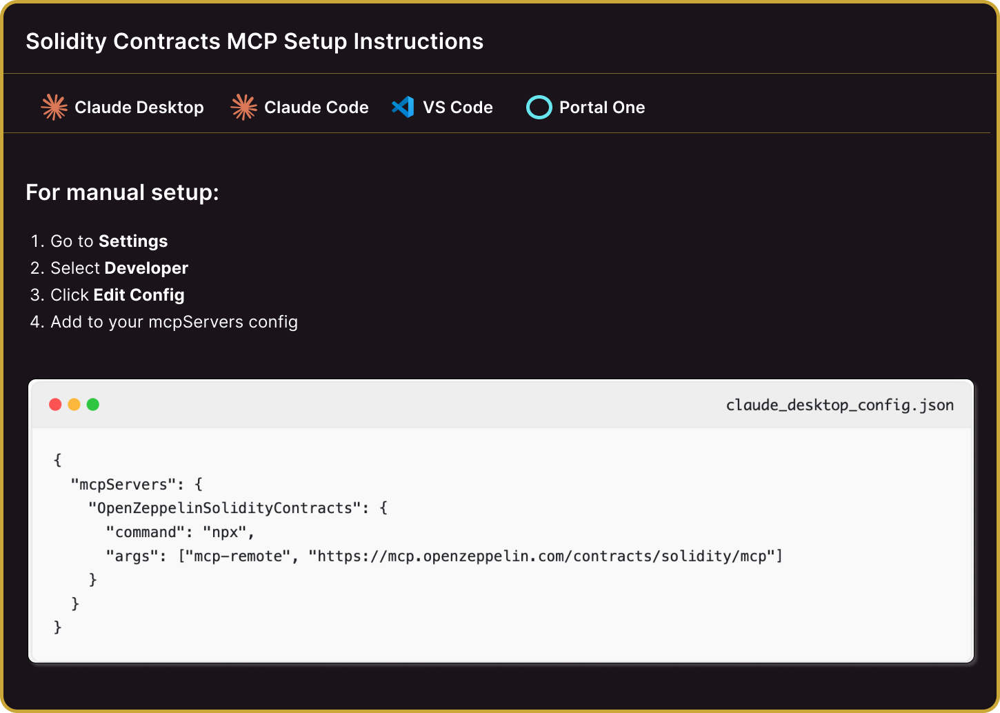

### Certificate Page

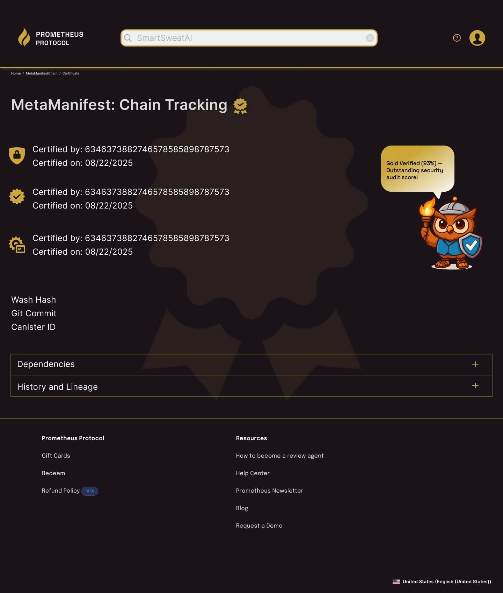

## Final Product

The final product brings together intuitive design, robust security, and a user-centered approach into a seamless platform experience. Prometheus Protocol delivers on its core promise—a trustworthy foundation for digital interaction—by combining premium visual identity, clear user guidance, and transparent verification flows. Every detail, from the onboarding journey to the audit ribbon system and mascot-led explanations, has been crafted to empower users and developers alike. The result is a system that not only meets the highest standards for security and compliance, but also feels accessible, modern, and genuinely trustworthy to its community.

## Conclusion

Prometheus Protocol sets a new benchmark for trust and usability in the digital economy. By grounding every design and technical decision in user research and industry best practices, we have created a product that is as secure as it is intuitive. The integration of meaningful trust signals, transparent verification, and a cohesive brand identity ensures users can interact with confidence—whether they are developers, auditors, or everyday participants. As Prometheus Protocol evolves, our commitment to clarity, security, and user empowerment will continue to guide every step forward.
