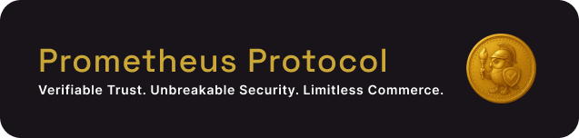

# Phase 2 Retrospective: Project Alliance

Phase 2: Project Alliance was all about scaling adoption and building a thriving ecosystem for the Model Context Protocol (MCP) through real-world incentives, community growth, and seamless integrations. Our challenge: Bootstrap a self-sustaining economy that attracts and rewards developers, auditors, and end-users—while reinforcing trust, transparency, and usability at every step.

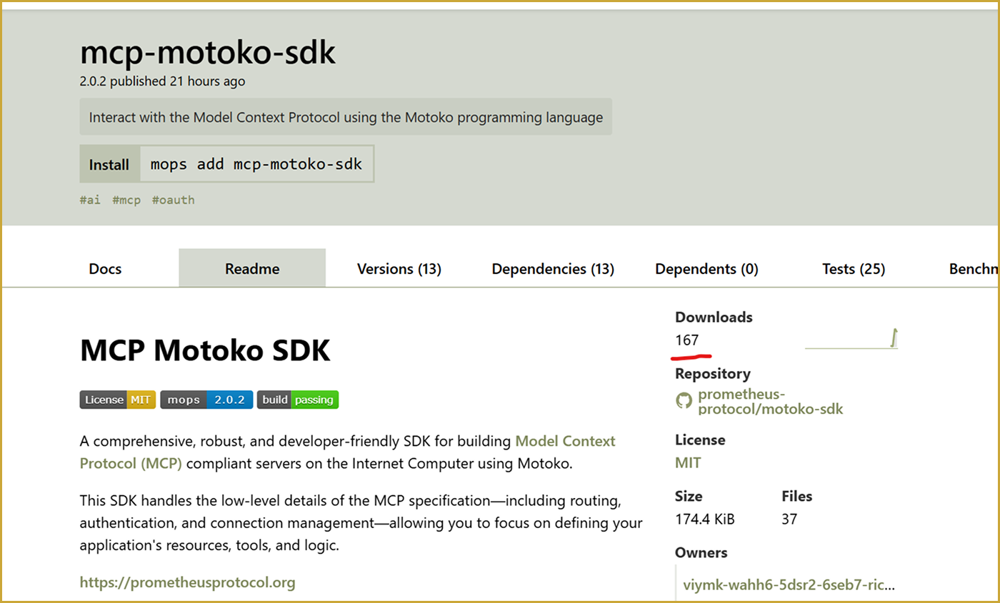

## The Challenge

> How might we incentivize high-value MCP server development, ensure rigorous security audits, and drive real usage—without sacrificing user experience or trust?
>
> How can we make onboarding, participation, and rewards effortless for both humans and AI agents in a decentralized, on-chain environment?

---

### 1. Research: Understanding the Ecosystem

We kicked off Phase 2 by diving deep into the Model Context Protocol (MCP) landscape. Our goal was to understand the ecosystem’s real needs and uncover opportunities for impact. We analyzed the latest in trust, incentives, and agent-driven workflows—setting the stage for features that would truly resonate with our target users.

- [Microsoft Introduces Logic Apps as MCP Servers in Public Preview](https://techcommunity.microsoft.com/t5/integrations-on-azure-blog/introducing-logic-apps-as-mcp-servers-in-public-preview/ba-p/4038138)
- [Creating and Deploying an MCP Server from Scratch](https://medium.com/@jesse.moore/creating-and-deploying-an-mcp-server-from-scratch-828853681352)
- [Tool-space interference in the MCP era: Designing for agent compatibility at scale](https://medium.com/@jesse.moore/tool-space-interference-in-the-mcp-era-designing-for-agent-compatibility-at-scale-51399779313a)

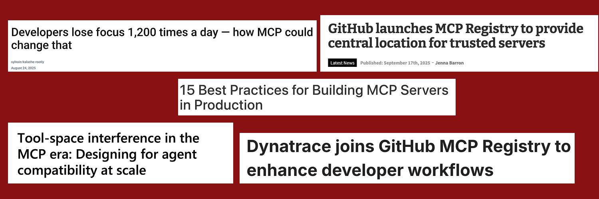

### 2. Design: Crafting the Contributor Experience

Armed with insight, we moved to design. We created high-fidelity mockups for the core elements of our ecosystem: the Bounty Board, Audit Page, and Leaderboard. Each design was evaluated for clarity, motivation, and accessibility, ensuring that contributors could easily find opportunities and trust the process from day one.

| Bounty Board                                             | Audit Hub                                  | Leaderboard                                    |
| -------------------------------------------------------- | ------------------------------------------ | ---------------------------------------------- |
| 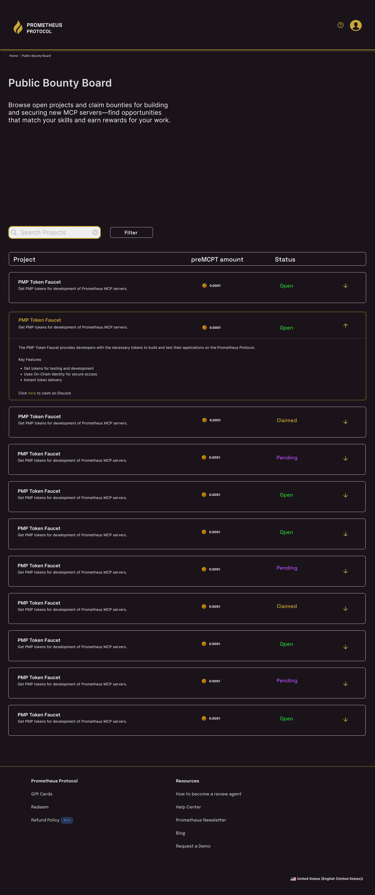 | 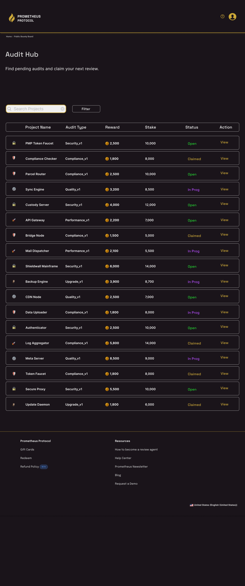 | 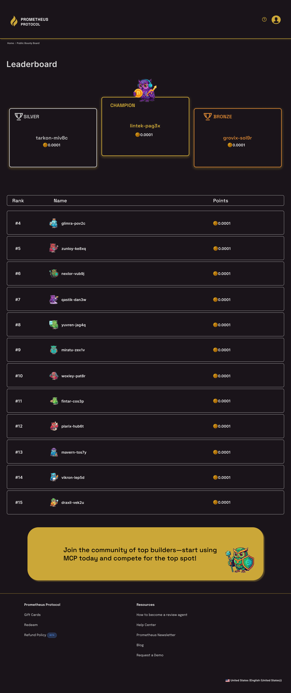 |

| Auditor Profile                                        | Claiming an Audit                  | Confirmation                                     |
| ------------------------------------------------------ | ---------------------------------- | ------------------------------------------------ |
| 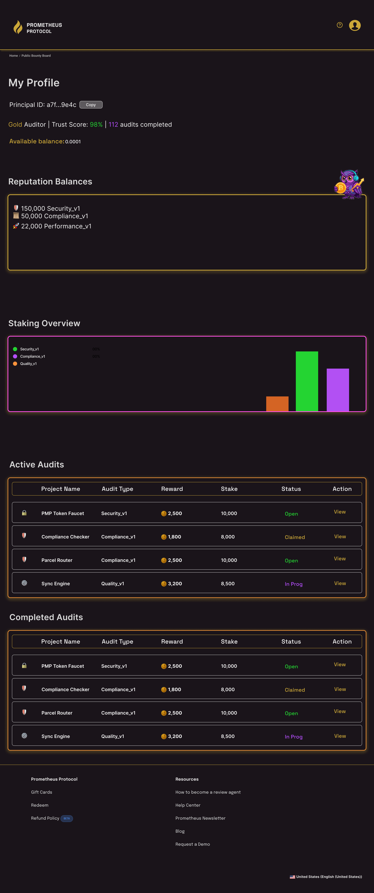 | 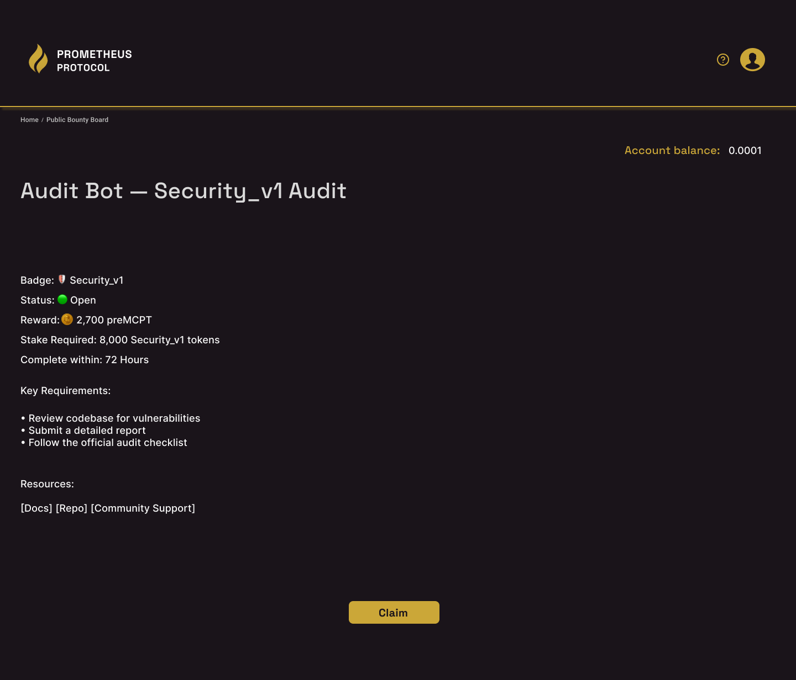 | 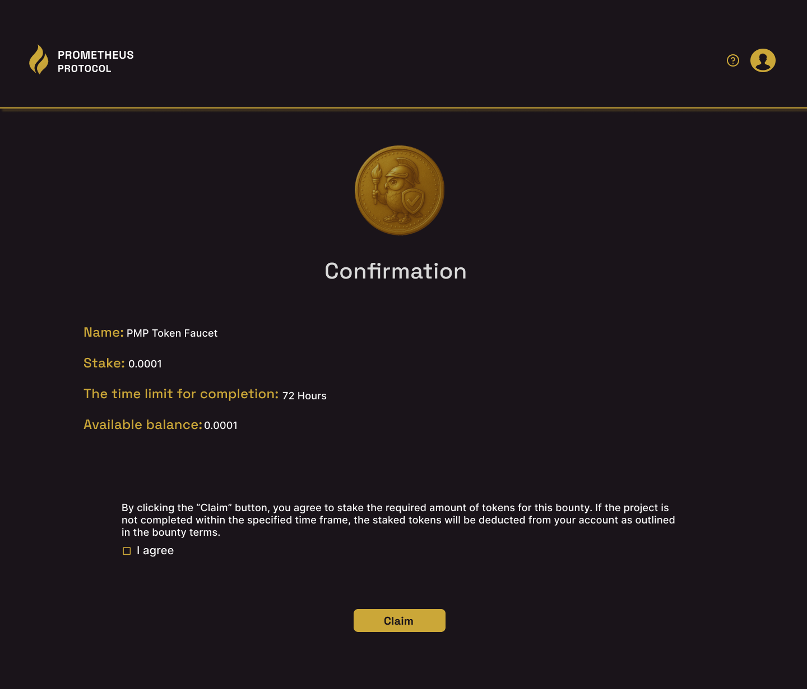 |

### 3. Community: Building Connections & Presence

Next, we focused on building real-world and online community. We attended developer and UX meetups across Denver, sharing our vision and gathering feedback. To deepen engagement, we hosted our own meetup—bringing together local innovators, designers, and blockchain enthusiasts for collaboration and conversation.

  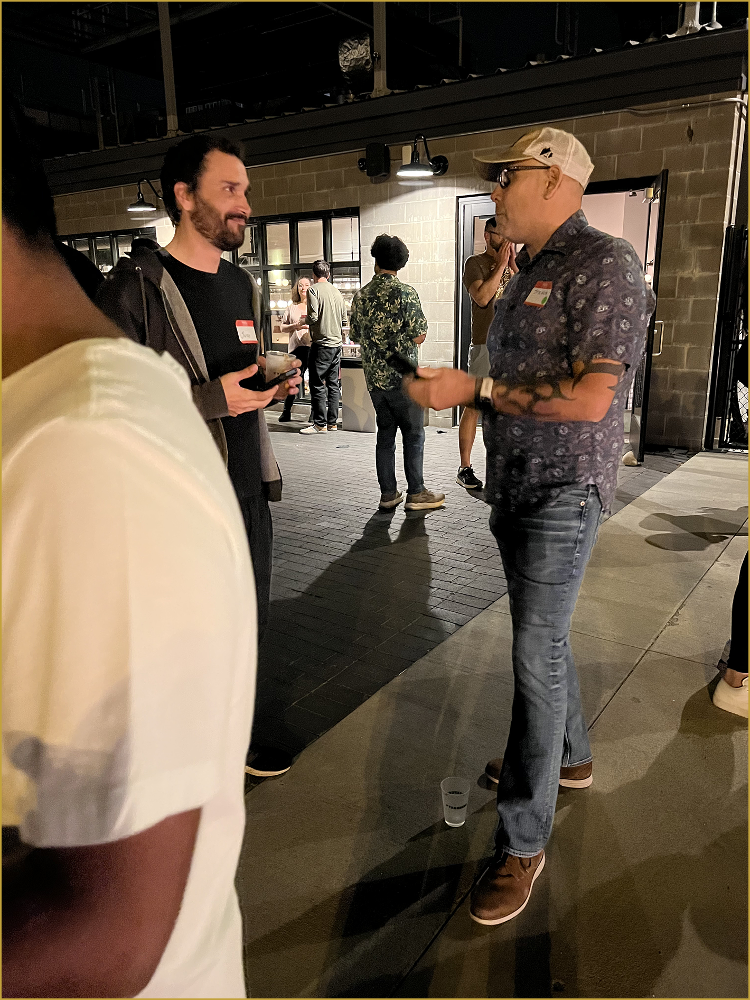
  &nbsp; &nbsp;
  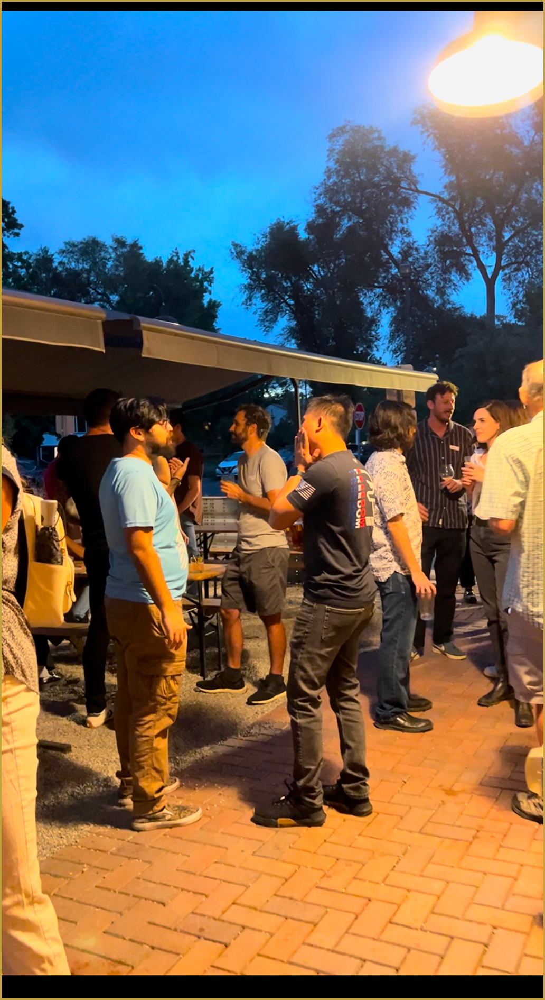

Simultaneously, we launched our official X (Twitter) account and secured a spot on a Denver crypto website to amplify our reach and welcome new participants.

  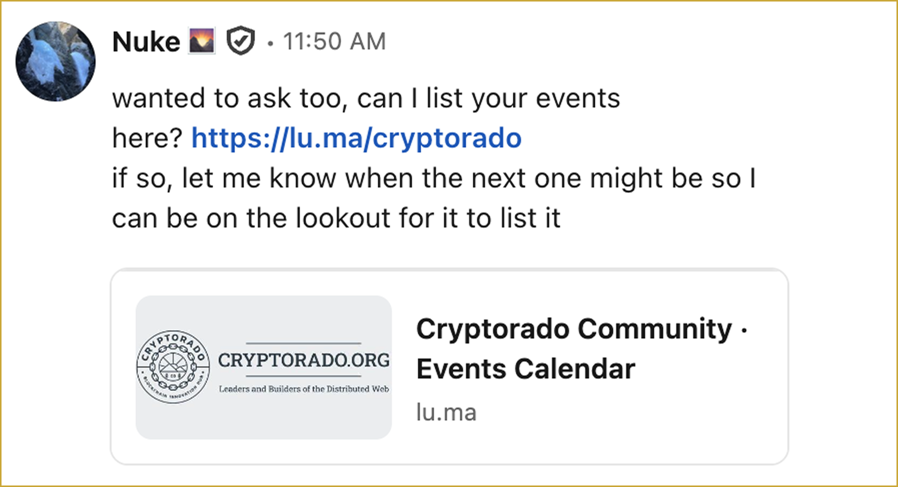
  &nbsp; &nbsp;
  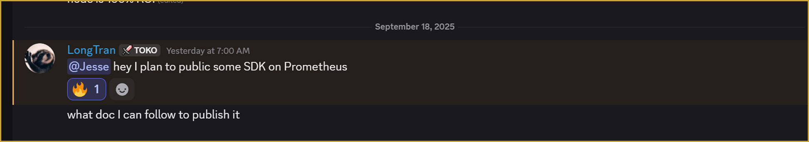

### 4. Listen: Validating with Real User Feedback

With community momentum building, we conducted targeted user interviews and distributed surveys to both developers and end-users. These direct conversations allowed us to validate our designs, discover pain points, and prioritize improvements based on real feedback—not assumptions.

  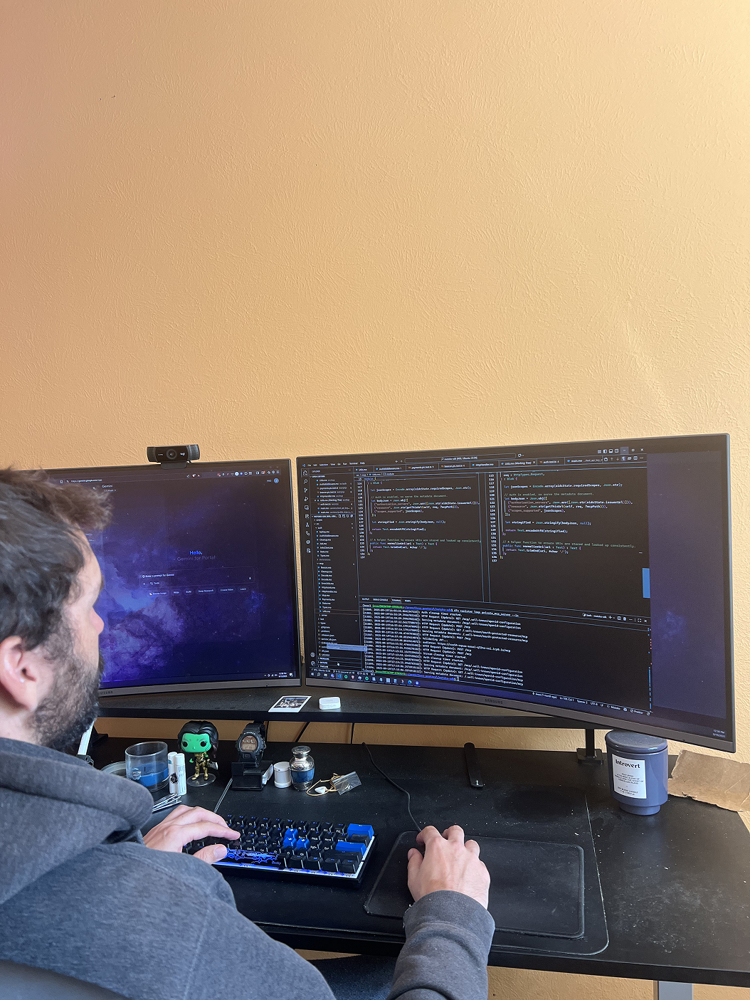
  &nbsp; &nbsp;
  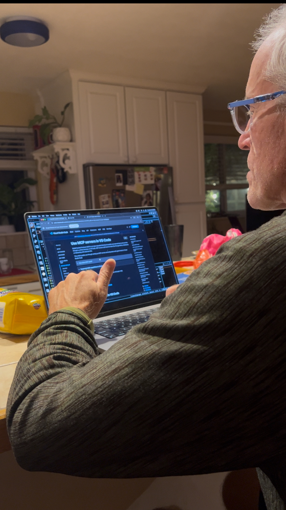

  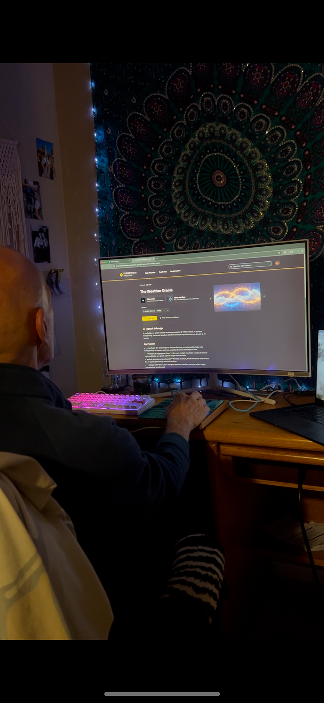
  &nbsp; &nbsp;
  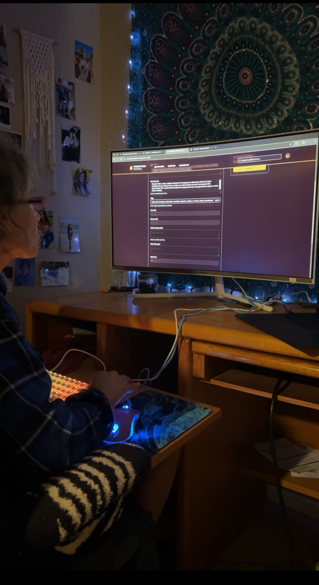

The feedback was overwhelmingly positive and provided clear direction for our next steps.

  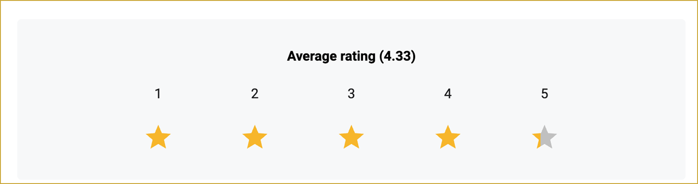
  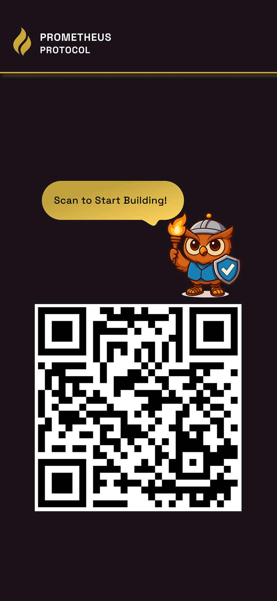
  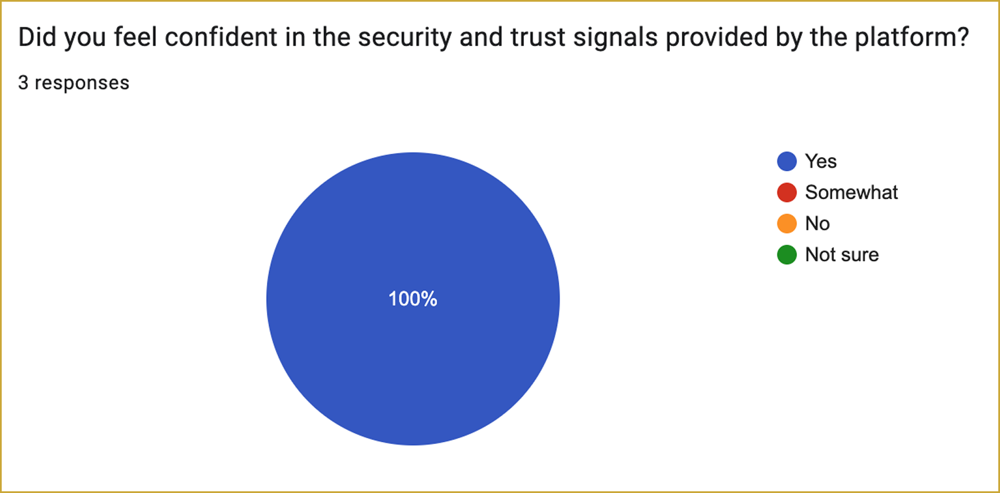

---

## The Takeaway

Phase 2 was a journey of discovery, design, and genuine community building—proving that user-centered research, collaborative design, and real-world engagement are the keys to sustainable ecosystem growth.
