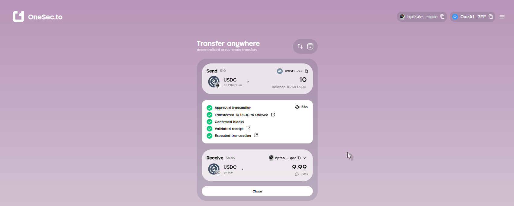
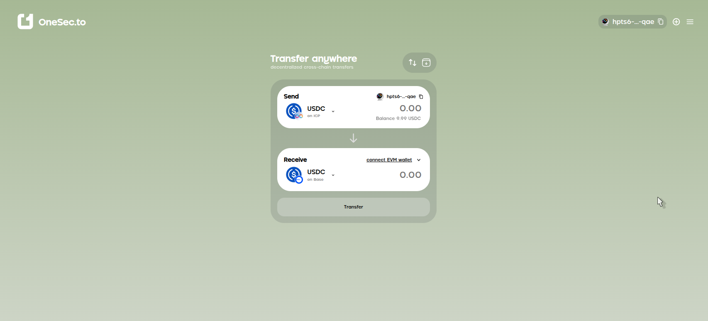
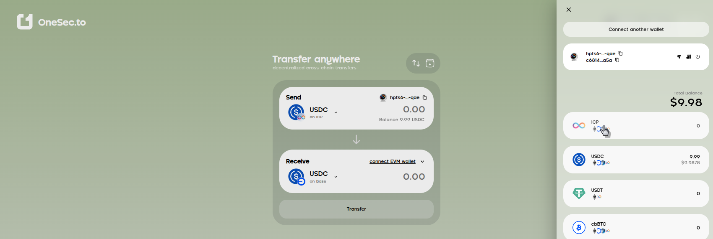
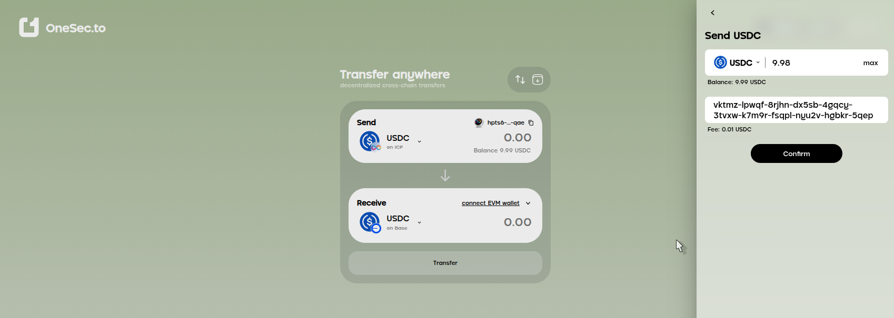
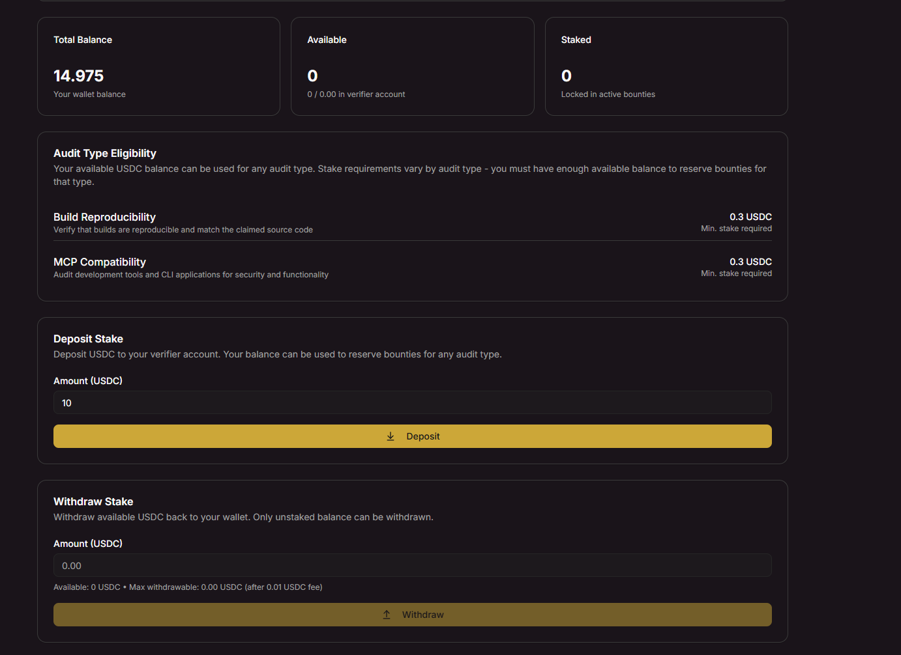

# Funding Your Verifier-Bot

## Purpose
This guide explains how to fund your Verifier-bot account with USDC tokens to participate in Internet Computer verification tasks.


## Prerequisites
- Wallet or Decentralized Exchange account **with USDC tokens** (recommend **10-20 USD**)  
- [Internet Identity](https://identity.ic0.app/)  
- Verifier Account  


**Example credentials used:**
- Wallet: 0x7a1b2c3d4e5f67890123456789abcdef01234567 (Binance Web3 Wallet)
- Internet Identity: k7m2p-n4jxv-b5r8t-ywqkl-2ufx3-vg7li-s66p8-fdgsq-v8yxh-wdpmr-qbe
- Verifier Account: vktmz-lpwqf-8rjhn-dx5sb-4gqcy-3tvxw-k7m9r-fsqpl-nyu2v-hgbkr-5qep

## Preparation

**Collect all addresses above before starting** - makes the procedure smoother.


## Procedure

1. Ensure you have **10-20 USD Coin** on **Ethereum network** in your Binance Web3 Wallet

2. **Fund Internet Identity wallet first**  
   - Go to [1sec.to](https://1sec.to/), login with Internet Identity  
   - Send USDC from Binance Web3 Wallet → Internet Identity wallet  
   ```
   From: 0x7a1b2c3d4e5f67890123456789abcdef01234567
   To:   k7m2p-n4jxv-b5r8t-ywqkl-2ufx3-vg7li-s66p8-fdgsq-v8yxh-wdpmr-qbe
   ```

   Set the USDC amount and click **[Transfer]**

   

   **Sign/accept** the transaction **on your Binance Web3 Wallet / source Wallet**

   

   **Confirm completion** - all statuses green, then [Close]

   

3. **Fund Verifier from Internet Identity**  
   - still in [1sec.to](https://1sec.to/)
   - Click the hamburger menu (☰ three horizontal lines) in the top-right corner
   
   
   
   
   - click **Send** button (paper plane icon, first icon at the right of Wallets addresses) 

   

   - Send USDC to your Verifier Account: `vktmz-lpwqf-8rjhn-dx5sb-4gqcy-3tvxw-k7m9r-fsqpl-nyu2v-hgbkr-5qep`

   

    **Result:** Verifier-bot account funded with USD Coin! Allow transaction processing time, then check Total Balance. Once funded, you're ready for verification tasks!

   


