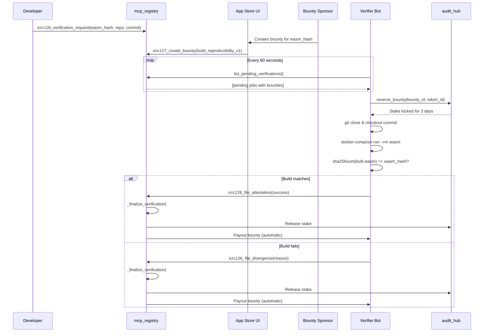

# Automated Build Verification System - Technical Specification

**Version:** 1.0.0  
**Status:** Phase 1 - Centralized Verifier  
**Date:** November 2, 2025

---

## Executive Summary

This document specifies the automated build verification system for the Prometheus Protocol MCP Server App Store. The system transforms the manual WASM verification process into a trustless, automated workflow using reproducible Docker builds and on-chain cryptoeconomic incentives.

### Current State (Manual)

- Developers submit WASM binaries with repo URLs and commit hashes
- Manual verification by trusted party clicking "Sponsor" button
- Bottleneck for scaling, single point of failure

### Target State (Automated)

- **Phase 1**: Centralized oracle polls pending verifications, runs reproducible builds, submits attestations
- **Phase 2**: Decentralized network of verifiers with consensus, staking, and slashing

---

## System Architecture

### Components

```
┌─────────────────────────────────────────────────────────────┐
│                    Internet Computer                        │
│                                                             │
│  ┌──────────────┐    ┌──────────────┐    ┌──────────────┐ │
│  │ mcp_registry │◄───┤  audit_hub   │◄───┤ ICRC-127     │ │
│  │              │    │              │    │ Bounties     │ │
│  │ - Pending    │    │ - Staking    │    │ - Escrow     │ │
│  │   queue      │    │ - Locking    │    │ - Payouts    │ │
│  │ - Finalize   │    │ - Slashing   │    │              │ │
│  └──────┬───────┘    └──────┬───────┘    └──────────────┘ │
│         │                   │                              │
└─────────┼───────────────────┼──────────────────────────────┘
          │                   │
          │ poll()            │ reserve()
          │ file_attestation()│
          │                   │
     ┌────▼───────────────────▼────┐
     │   Verifier Bot (Render)     │
     │   ┌──────────────────────┐  │
     │   │  Node.js Runtime     │  │
     │   │  - Polling loop      │  │
     │   │  - IC agent          │  │
     │   └──────────┬───────────┘  │
     │              │              │
     │   ┌──────────▼───────────┐  │
     │   │  Docker-in-Docker    │  │
     │   │  - Git clone         │  │
     │   │  - Reproducible build│  │
     │   │  - Hash comparison   │  │
     │   └──────────────────────┘  │
     └─────────────────────────────┘
```

---

## Phase 1: Centralized Verifier

### 1.1 The Verification Workflow



### 1.2 Canister Methods (Already Implemented)

#### mcp_registry Canister

| Method                              | Description                                                                    | Caller       |
| ----------------------------------- | ------------------------------------------------------------------------------ | ------------ |
| `list_pending_verifications()`      | Returns all verification requests that are not finalized and not yet sponsored | Verifier Bot |
| `get_verification_request(wasm_id)` | Fetches repo URL and commit hash for a specific WASM                           | Verifier Bot |
| `get_bounties_for_wasm(wasm_id)`    | Lists all bounties for a WASM (filter by `audit_type`)                         | Verifier Bot |
| `icrc126_file_attestation(request)` | Submits successful verification, triggers `_finalize_verification(#Verified)`  | Verifier Bot |
| `icrc126_file_divergence(request)`  | Submits failed verification, triggers `_finalize_verification(#Rejected)`      | Verifier Bot |

**Critical Authorization**: Both attestation methods check `audit_hub.is_bounty_ready_for_collection()` before accepting submissions.

#### audit_hub Canister

| Method                                                 | Description                                                 | Caller       |
| ------------------------------------------------------ | ----------------------------------------------------------- | ------------ |
| `reserve_bounty(bounty_id, token_id)`                  | Stakes reputation tokens, creates 3-day lock                | Verifier Bot |
| `is_bounty_ready_for_collection(bounty_id, principal)` | Validates that caller is the authorized claimant            | mcp_registry |
| `cleanup_expired_lock(bounty_id)`                      | Slashes stake if verifier abandons job (callable by anyone) | Anyone       |
| `get_auditor_profile(principal)`                       | Returns available/staked balances and reputation            | UI/Bot       |

### 1.3 Reproducible Build Environment

The verifier uses a **deterministic Docker-based build** system:

#### Base Image (`Dockerfile.base`)

- Alpine Linux (minimal, 76 MB)
- Pinned versions:
  - `moc` 0.14.9 (Motoko compiler)
  - `ic-wasm` 0.9.3 (WASM optimizer)
  - `mops-cli` 0.2.0 (Motoko package manager)

#### Build Process (`build.sh`)

```bash
mops-cli build --lock --name out src/main.mo -- <MOC_FLAGS>
cp target/out/out.wasm $OUT
ic-wasm $OUT -o $OUT shrink
ic-wasm $OUT -o $OUT metadata candid:service -f did/service.did -v public
sha256sum $OUT
```

#### Security Features

1. **Sandboxing**: Each build runs in an isolated Docker container
2. **Resource Limits**: Docker inherently limits CPU, memory, and time
3. **Network Isolation**: No network access during build (--network=none)
4. **Non-root User**: Builds run as unprivileged user
5. **Time Limits**: 10 minutes max per build

#### Determinism Guarantees

- Same source code **always** produces the same WASM hash
- Architecture-independent (Linux x86_64 output regardless of host)
- Proven by test vectors (see libs/icrc118/README.md)

---

## Phase 2: Decentralized Network (Future)

### 2.1 Consensus Mechanism

**Schelling Point Design**: Verifiers independently compute the same result and are rewarded for agreement.

#### Workflow

1. A bounty is created with `M` total reward tokens
2. `N` verifiers reserve the bounty (random selection or first-come-first-served)
3. Each verifier stakes `S` reputation tokens
4. Each verifier submits their vote: `(wasm_hash, picjs_test_passed: bool)`
5. Registry tallies votes once 2/3 supermajority is reached
6. **Honest verifiers** (7 out of 10): Split `M` reward, stake returned
7. **Dishonest verifiers** (3 out of 10): Stake slashed (burned or redistributed)

### 2.2 Economic Security

**Staking Formula**: `S >= 2 * M / N`

This ensures that the cost of a 51% attack exceeds the potential gain.

**Example**:

- Bounty reward: 100 USDC
- Number of verifiers: 10
- Minimum stake per verifier: 20 USDC in reputation tokens

An attacker controlling 6 verifiers would need to stake 120 USDC to corrupt the result but only gain 100 USDC, making the attack unprofitable.

### 2.3 Sybil Resistance

**Primary Defense**: Staking requirement creates a cost barrier.

**Secondary Defense**: Verifier registration with identity verification (e.g., proof of humanity, GitHub commits, ICP neuron holdings).

### 2.4 Attack Vectors & Mitigations

| Attack                           | Mitigation                                                           |
| -------------------------------- | -------------------------------------------------------------------- |
| **Non-deterministic builds**     | Strict environment control, pinned toolchain versions, test vectors  |
| **Timestamp/environment checks** | Sterile build environment with no system time access                 |
| **Slow builds (DoS)**            | 10-minute timeout, reputation slashing on timeout                    |
| **Stake grinding**               | Minimum stake enforced by protocol, reputation cannot be transferred |
| **Front-running**                | Commit-reveal scheme for votes (future enhancement)                  |

---

## Data Structures

### VerificationRecord (ICRC126)

```motoko
{
  repo: Text;              // "https://github.com/org/repo"
  commit_hash: Text;       // Full 40-char SHA-1
  wasm_hash: Blob;         // SHA-256 of WASM binary
  requester: Principal;    // Developer who submitted
  timestamp: Int;          // Nanoseconds since epoch
  metadata: ICRC16Map;     // Optional: canister_name, deployment_type
}
```

### Bounty (ICRC127)

```motoko
{
  bounty_id: Nat;
  challenge_parameters: {
    wasm_hash: Blob;
    audit_type: Text;      // "build_reproducibility_v1"
  };
  bounty_metadata: {
    icrc127:reward_canister: Principal;  // USDC ledger
    icrc127:reward_amount: Nat;          // Atomic units
  };
  timeout_date: Int;       // Deadline in nanoseconds
  validation_canister_id: Principal;  // mcp_registry
}
```

### BountyLock (Audit Hub)

```motoko
{
  claimant: Principal;     // Verifier who reserved
  expires_at: Int;         // 3 days from reservation
  stake_amount: Nat;       // Tokens staked
  stake_token_id: Text;    // "build_reproducibility_v1"
}
```

---

## Verifier Bot Implementation

### 3.1 Environment Variables

```bash
VERIFIER_PEM           # Ed25519 private key (PEM format)
IC_NETWORK             # "ic" for mainnet
POLL_INTERVAL_MS       # Default: 60000 (1 minute)
MAX_CONCURRENT_JOBS    # Default: 1 (Phase 1)
BUILD_TIMEOUT_MS       # Default: 600000 (10 minutes)
```

### 3.2 Main Loop Pseudocode

```typescript
async function pollAndVerify() {
  // 1. Fetch pending jobs
  const pending = await listPendingVerifications();

  for (const job of pending) {
    // 2. Check if job has a build_reproducibility_v1 bounty
    const bounties = await getBountiesForWasm(job.wasm_hash);
    const buildBounty = bounties.find(
      (b) => b.audit_type === 'build_reproducibility_v1',
    );

    if (!buildBounty) continue; // No bounty yet

    try {
      // 3. Reserve the bounty (stake reputation)
      await reserveBounty(buildBounty.id, 'build_reproducibility_v1');

      // 4. Run reproducible build
      const result = await verifyBuild(
        job.repo,
        job.commit_hash,
        job.wasm_hash,
      );

      // 5. Submit result
      if (result.success) {
        await fileAttestation(buildBounty.id, job.wasm_hash, result.metadata);
      } else {
        await submitDivergence(buildBounty.id, job.wasm_hash, result.error);
      }
    } catch (error) {
      console.error('Verification failed:', error);
      // Lock will expire in 3 days, stake will be slashed
    }
  }
}

setInterval(pollAndVerify, POLL_INTERVAL_MS);
```

### 3.3 Docker Build Orchestration

The verifier:

1. Clones the developer's repository
2. Checks out the specific commit
3. Copies the reproducible build template into the canister directory
4. Generates `mops.toml` if missing (extracts dependencies from dfx.json)
5. Runs `docker-compose run --rm wasm` inside the canister directory
6. Reads the output WASM from `out/out_Linux_x86_64.wasm`
7. Computes SHA-256 hash
8. Compares against the submitted `wasm_hash`

---

## Deployment

### 4.1 Prerequisites

**On-Chain Setup**:

1. Generate verifier identity: `dfx identity new verifier && dfx identity export verifier > verifier.pem`
2. Get principal: `dfx identity use verifier && dfx identity get-principal`
3. Mint initial reputation tokens to verifier principal:
   ```bash
   dfx canister call audit_hub mint_tokens \
     '(principal "<verifier-principal>", "build_reproducibility_v1", 1000000)'
   ```

**Render.com Setup**:

1. Create new "Background Worker" service
2. Connect to GitHub repo
3. Set root directory: `packages/apps/verifier-bot`
4. Add secret: `VERIFIER_PEM` (contents of verifier.pem)
5. Deploy

### 4.2 Monitoring

**Logs to Track**:

- `🔍 Polling for pending verifications...` - Heartbeat
- `🎯 Processing job: <wasm_hash>` - Job start
- `✅ <wasm_hash> verified and finalized!` - Success
- `❌ <wasm_hash> marked as divergent` - Failure
- `❌ Error processing <wasm_hash>: <error>` - Exception

**Metrics**:

- Jobs processed per hour
- Success rate (verified vs divergent)
- Average build time
- Stake balance (should remain stable)
- Bounty earnings (should increase steadily)

### 4.3 Maintenance

**Weekly**:

- Review logs for anomalies
- Check stake balance (top up if needed)
- Monitor build times (optimize if increasing)

**Per Toolchain Upgrade**:

- Update `docker-compose.yml` with new moc/ic-wasm versions
- Redeploy verifier bot
- Test on a known-good build

---

## Testing Strategy

### 5.1 Unit Tests

- Docker build orchestration (mock git/docker commands)
- Hash comparison logic
- ICRC16 metadata serialization

### 5.2 Integration Tests

1. **Happy Path**: Submit valid repo, expect attestation filed
2. **Hash Mismatch**: Submit mismatched hash, expect divergence filed
3. **Build Failure**: Submit unbuildable code, expect divergence filed
4. **Timeout**: Submit slow build, expect timeout and divergence
5. **Malformed Repo**: Submit invalid git URL, expect error handling

### 5.3 Mainnet Canary

Deploy to production with a **test canister** that has known-good builds. Verify the bot correctly processes these before enabling for real apps.

---

## Future Enhancements

### Phase 2 (Decentralized Network)

- [ ] Multi-verifier consensus logic in `mcp_registry`
- [ ] Vote tallying and supermajority detection
- [ ] Proportional reward distribution
- [ ] Slashing logic for dishonest verifiers
- [ ] Verifier registration system

### Phase 3 (Advanced Features)

- [ ] **PicJS Integration**: Run test suites in Docker to verify behavior
- [ ] **Commit-reveal voting**: Prevent front-running in Phase 2
- [ ] **Verifier Dashboard**: UI showing leaderboard, earnings, stake
- [ ] **Batch Processing**: Verify multiple WASMs in parallel
- [ ] **Canister Upgrades**: Verify upgrade compatibility

---

## References

- ICRC-126 Specification: [ICRC-126.md](../../libs/icrc118/ICRC126.md)
- ICRC-127 Bounty Standard: [ICRC-127.md](../../libs/icrc118/ICRC127.md)
- Reproducible Builds Template: [libs/icrc118/README.md](../../libs/icrc118/README.md)
- Motoko Compiler: https://github.com/dfinity/motoko
- ic-wasm Tool: https://github.com/research-ag/ic-wasm

---

## Changelog

### v1.0.0 (2025-11-02)

- Initial specification for Phase 1 centralized verifier
- Reproducible build environment defined
- Deployment strategy documented
