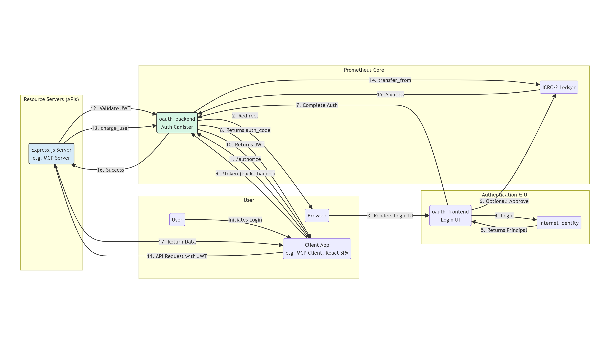
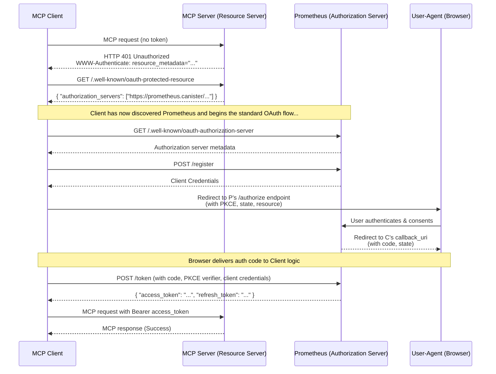
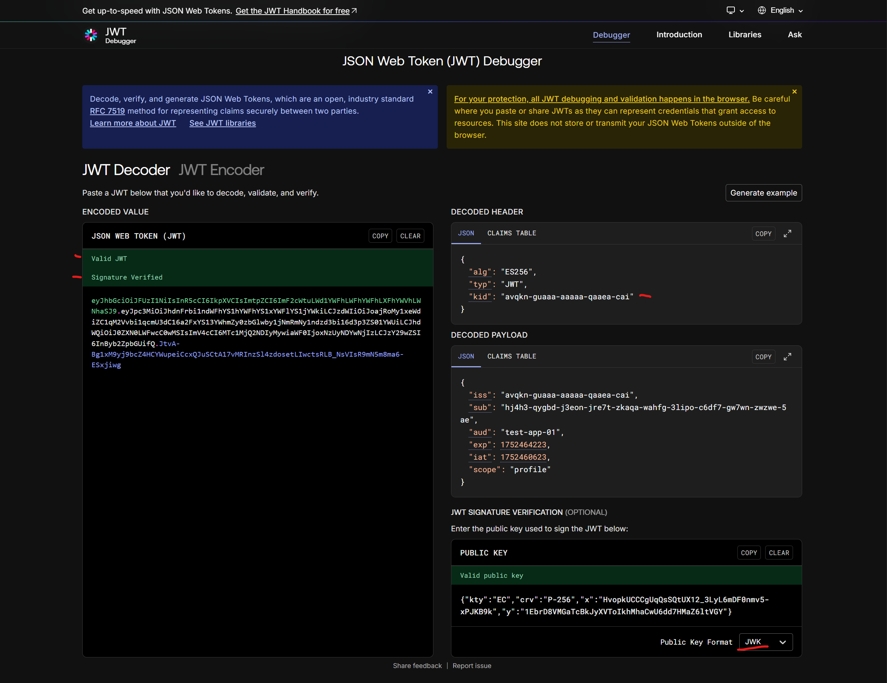

# Prometheus Auth Server

This README is for the `auth_server` canister, the on-chain OAuth 2.1 provider for the Prometheus Protocol ecosystem. It is located within the main [`prometheus-protocol`](https://github.com/prometheus-protocol/prometheus-protocol) monorepo.


## Overview

This canister is a full-featured, on-chain **OAuth 2.1 provider** built for the Internet Computer. It provides a robust, general-purpose solution for any application requiring standards-based authentication and authorization.

While designed for broad use, it is also a fully compliant **Authorization Server** for the **Model Context Protocol (MCP)** ecosystem. This dual focus ensures this canister is both a flexible tool for the wider IC community and a hardened, specification-compliant engine for enterprise-grade protocols.

It enables developers to secure applications using the industry-standard **Authorization Code Flow with PKCE** and supports flexible, **multi-token payment authorization**, allowing resource servers to define which ICRC-2 tokens they accept for payment-gated scopes.

## Live Ecosystem & Demos

The Prometheus Auth Server is live on ICP mainnet. You can interact with it and see it in action through these resources:

- **[Prometheus Protocol Dashboard](https://bmfnl-jqaaa-aaaai-q32ha-cai.icp0.io/):** Manage your client applications, grants, and allowances.
- **[PMP Token Faucet](https://remote-mcp-servers.com/servers/e4dc7647-14d3-43da-8513-3087e013cd3b):** A live MCP server that provides free PMP test tokens to help you get started with development.
- **[Sentiment Analysis Demo](https://remote-mcp-servers.com/servers/491314bc-27b3-4070-b2c2-39ad971c36c4):** A simple, monetized AI tool built with our TypeScript SDK that demonstrates the end-to-end payment flow.

## Features & Compliance

This canister implements the latest security best practices from the IETF and the specific requirements of the MCP specification.

- ✓ **OAuth 2.1 Core:** Implements the modern, secure baseline for OAuth, including mandatory PKCE (`RFC 7636`) and the Authorization Code Flow (`RFC 6749`).
- ✓ **Refresh Token Rotation:** Enhances security by issuing a new, single-use refresh token each time one is used, mitigating the risk of token theft.
- ✓ **Dynamic Client Registration (DCR):** A public `/register` endpoint (`RFC 7591`) allows applications to register programmatically without manual intervention.
- ✓ **Resource Indicators:** Supports token audience binding via the `resource` parameter (`RFC 8707`), ensuring tokens are used only at their intended destination.
- ✓ **ICRC-2 Payment Authorization:** Enables resource servers to specify a list of accepted ICRC-2 compliant tokens for payment-gated scopes (e.g., `prometheus:charge`).
- ✓ **Server Metadata:** Provides `/.well-known/oauth-authorization-server` (`RFC 8414`) and `/.well-known/jwks.json` endpoints for automated client configuration and key discovery.
- ✓ **MCP Authorization Spec Compliant:** Fully adheres to the requirements for an Authorization Server within the MCP ecosystem (rev. 2025-06-18).

## Architecture

This canister is designed to be a foundational piece of infrastructure for the Internet Computer, enabling secure interactions between users, client applications, and protected resource servers.

### Architectural Diagram



### Key Components

- **Client Application (e.g., an MCP Client, a React SPA):** The user-facing application that initiates the login flow.
- **Prometheus Auth Server (This Canister):** The central Authorization Server that handles user authentication, consent, and the issuance of secure tokens.
- **Resource Server (e.g., an MCP Server, a protected backend API):** The service that requires authorization and validates the tokens issued by this canister before granting access to its resources.

<details>
  <summary><strong>Understanding the MCP Discovery Flow</strong></summary>



</details>

## On-Chain Security Model

Building a secure OAuth 2.1 provider on a public blockchain requires a specific design. This canister is built on a "trustless" model where security is enforced by cryptography at the protocol level, not by trusting the network's boundary nodes.

### 1. Protection of Secrets during Token Exchange

The most critical part of the OAuth flow is the `/token` endpoint, where a short-lived `authorization_code` is exchanged for a long-lived `access_token`.

- **State Change is Required:** To prevent replay attacks, the canister **must** change its state to invalidate the `authorization_code` after a single use. On the IC, any state-changing call must be an **`update` call**.
- **Security of the On-Chain Response:** For clients without an IC identity, the response containing the secret `access_token` is temporarily written to the IC's state tree. This is secure due to two fundamental IC features:
  1.  **Secret Path via `request_id`:** The response is stored at a path derived from a secret `request_id`. This ID is a hash of the request's content, which includes secrets known only to the client (the `authorization_code`, `PKCE verifier`, and a random `nonce`). An attacker cannot predict this ID and therefore cannot find the token in the state tree.
  2.  **Certified Responses & Secure Transport:** The boundary node that retrieves this result for the client receives it along with a **Certificate** signed by the IC. This certificate cryptographically proves the response is authentic and untampered. The boundary node then delivers this certified response to the client over a standard, secure HTTPS (TLS) connection.

### 2. PKCE as a Hard Requirement

This canister enforces **Proof Key for Code Exchange (PKCE)** on all authorization code grants, as mandated by OAuth 2.1. This is the primary defense against authorization code interception attacks. Even if an attacker steals a `code` from a redirect URL, it is useless without the corresponding secret `code_verifier`, which never leaves the legitimate client.

## Getting Started (Local Development)

> **Note:** All commands should be run from the **root** of the `prometheus-protocol` monorepo, not from within this package directory.

### Prerequisites

- [DFINITY Canister SDK (dfx)](https://internetcomputer.org/docs/current/developer-docs/setup/install/)
- [Node.js](https://nodejs.org/) & [pnpm](https://pnpm.io/installation)
- [Mops](https://mops.one/) (Motoko Package Manager)
- [jq](https://stedolan.github.io/jq/) (Command-line JSON processor)

### 1. Clone & Install

```bash
git clone https://github.com/prometheus-protocol/prometheus-protocol.git
cd prometheus-protocol
pnpm install
mops install
```

### 2. Deploy Local Environment

This command starts a local replica and deploys all canisters in the project, including this auth server and mock ICRC-2 ledgers.

```bash
dfx start --clean --background
pnpm deploy:local
```

## Running the Full Test Flow

> The following scripts are located in the `/scripts` directory at the monorepo root.

### Phase 1: Register a Resource Server

This script registers a mock resource server configured to accept payments in multiple ICRC-2 tokens.

```bash
./scripts/register_resource_server.sh
```

### Phase 2: Register Your Client

Your application first needs to register itself with the auth server to get credentials.

```bash
# This script calls the /register endpoint and saves credentials to .env.prom
./scripts/register_client.sh
```

### Phase 3: Initiate User Authorization

1.  **Generate the Authorize URL:** This script creates a secure PKCE challenge and constructs the full authorization URL.
    ```bash
    # This generates the URL and saves the PKCE verifier to .env.prom
    node ./scripts/generate-auth-url.js
    ```
2.  **Authorize in Browser:**
    - Copy the full `/authorize` URL printed by the script.
    - Paste it into your browser and complete the Internet Identity login.
    - If the `prometheus:charge` scope was requested, you will be prompted to select a payment token and set an allowance.
    - You will be redirected to `https://jwt.io` (our example `redirect_uri`).
    - **Copy the `code` value from the resulting URL.**

### Phase 4: Exchange the Code for Tokens

1.  **Load Credentials:** Make sure your shell has the `client_id` and `PKCE_VERIFIER` loaded.
    ```bash
    source .env.prom
    ```
2.  **Get Tokens:** Run the `get_token.sh` script, passing the code you copied.
    ```bash
    ./scripts/get_token.sh <THE_CODE_YOU_COPIED>
    ```

### Phase 5: Verify the JWT

A Resource Server performs this step to validate the token.

1.  **Go to [jwt.io](https://jwt.io)** and paste the `access_token` into the "Encoded" box.
2.  **Get the Public Key:** Run the following command to fetch the server's public key set.
    ```bash
    # Note: 'auth_server' must match the canister name in dfx.json
    curl http://$(dfx canister id auth_server).localhost:4943/.well-known/jwks.json | jq
    ```
3.  **Verify Signature:** Paste the key object from the terminal into the "Public Key" box on jwt.io and change the format dropdown to `JWK`.



## Running Tests

> All test commands should be run from the monorepo root.

```bash
# Run all Motoko unit and integration tests
mops test

# Run all end-to-end tests
pnpm test
```

## License

This project is licensed under the MIT License.
